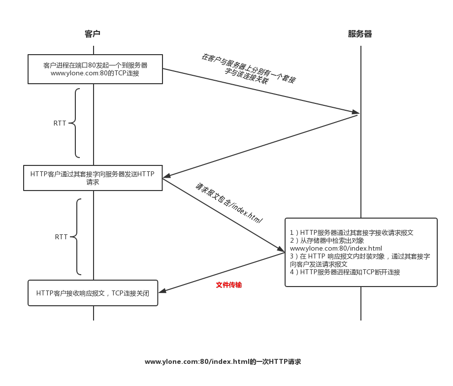
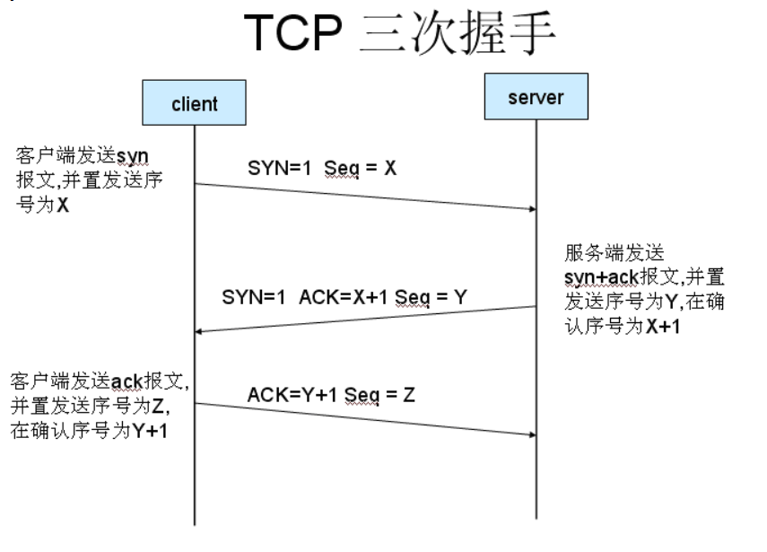
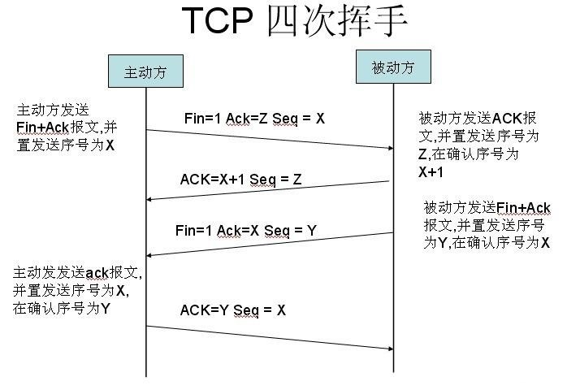
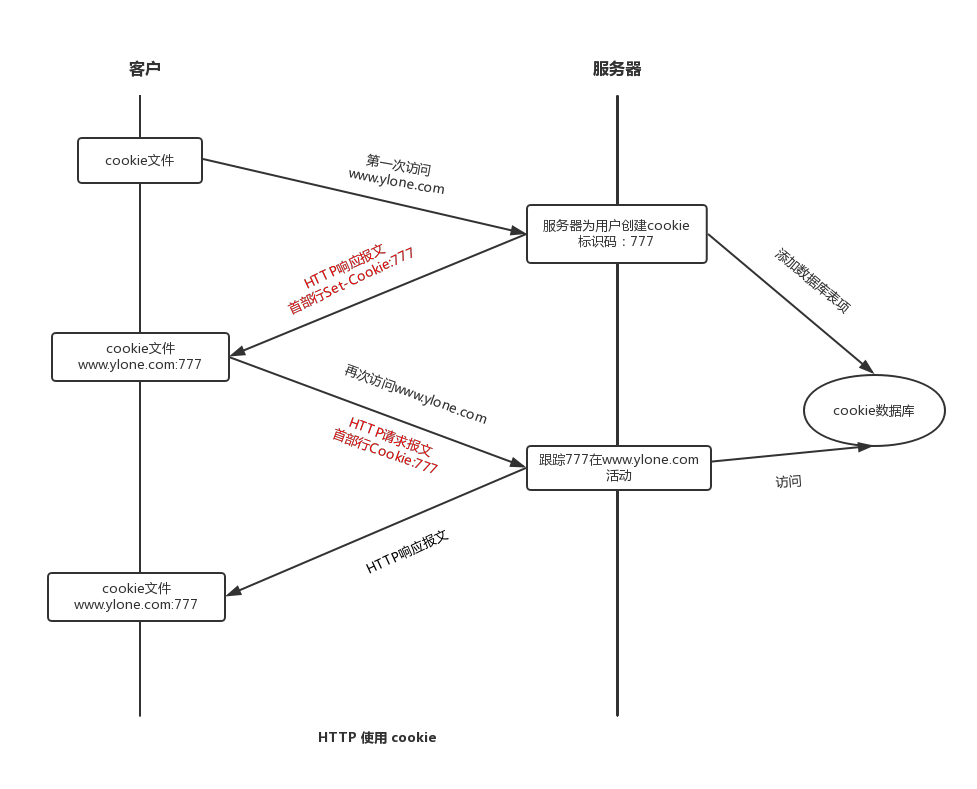

<!-- MarkdownTOC -->

- [进程通信](#%E8%BF%9B%E7%A8%8B%E9%80%9A%E4%BF%A1)
- [DNS 因特网的目录服务](#dns-%E5%9B%A0%E7%89%B9%E7%BD%91%E7%9A%84%E7%9B%AE%E5%BD%95%E6%9C%8D%E5%8A%A1)
- [HTTP](#http)
  - [HTTP状态码](#http%E7%8A%B6%E6%80%81%E7%A0%81)
  - [RTT](#rtt)
  - [HTTP请求报文](#http%E8%AF%B7%E6%B1%82%E6%8A%A5%E6%96%87)
  - [HTTP响应报文](#http%E5%93%8D%E5%BA%94%E6%8A%A5%E6%96%87)
- [三次握手](#%E4%B8%89%E6%AC%A1%E6%8F%A1%E6%89%8B)
- [四次分手](#%E5%9B%9B%E6%AC%A1%E5%88%86%E6%89%8B)
- [Cookie](#cookie)
- [TCP连接方式](#tcp%E8%BF%9E%E6%8E%A5%E6%96%B9%E5%BC%8F)
- [使TCP连接安全：SSL](#%E4%BD%BFtcp%E8%BF%9E%E6%8E%A5%E5%AE%89%E5%85%A8%EF%BC%9Assl)
    - [运输层服务的四个重要属性](#%E8%BF%90%E8%BE%93%E5%B1%82%E6%9C%8D%E5%8A%A1%E7%9A%84%E5%9B%9B%E4%B8%AA%E9%87%8D%E8%A6%81%E5%B1%9E%E6%80%A7)
    - [FTP 文件传输协议](#ftp-%E6%96%87%E4%BB%B6%E4%BC%A0%E8%BE%93%E5%8D%8F%E8%AE%AE)
    - [E-mail](#e-mail)
  - [运输层](#%E8%BF%90%E8%BE%93%E5%B1%82)
    - [运输层和网络层关系](#%E8%BF%90%E8%BE%93%E5%B1%82%E5%92%8C%E7%BD%91%E7%BB%9C%E5%B1%82%E5%85%B3%E7%B3%BB)
    - [多路复用与多路分解](#%E5%A4%9A%E8%B7%AF%E5%A4%8D%E7%94%A8%E4%B8%8E%E5%A4%9A%E8%B7%AF%E5%88%86%E8%A7%A3)
    - [UDP](#udp)
    - [构建可靠数据传输](#%E6%9E%84%E5%BB%BA%E5%8F%AF%E9%9D%A0%E6%95%B0%E6%8D%AE%E4%BC%A0%E8%BE%93)
    - [TCP](#tcp)
    - [可靠数据传输](#%E5%8F%AF%E9%9D%A0%E6%95%B0%E6%8D%AE%E4%BC%A0%E8%BE%93)
    - [流量控制](#%E6%B5%81%E9%87%8F%E6%8E%A7%E5%88%B6)

<!-- /MarkdownTOC -->

> 研发网络应用程序的 **核心** 是写出能够运行在不同的端系统和通过网络彼此通信的程序

## 进程通信
  
在操作系统中，进行通信的实际上是进程（process）而不是程序。一个进程可以被认为是运行在端系统的一个程序

当进程运行在相同的端系统(即同一电脑)上时，它们使用进程间的通信机制相互通信。进程间通信的规则由端系统上的操作系统确定

在两个不同端系统上的进程，通过跨越计算机网络交换报文而相互通信。发送进程生成报文并发送到网络中，接收进程接收这些报文并可能通过将报文发送回去进行响应

定义客户和服务器进程：在给定的一对进程之间的通信会话场景中，**发起通信** （即在该会话开始时发起与其他进程的联系）的进程被标识为客户，在会话开始时 **等待联系** 的进程是服务器

进程间通过套接字（socket）软件接口向网络发送或者接收报文

套接字是同一台主机内应用层和传输层之间的 **接口**，由于套接字是建立网络应用程序的可编程接口，因此套接字也被称为应用程序和网络之间的应用程序编程接口（API）

通过 ip（主机地址） 和 port（主机中接收进程标识符）来标识进程通信中的接收进程


## DNS 因特网的目录服务

主机名和IP地址是识别主机的两种方式，人们喜欢主机名的标记方式，而路由器则更喜欢定长的，有着层次结构的IP地址，为此，我们需要一种能进行主机名到IP地址转换的目录服务，这就是域名系统（Domain Name System, DNS）

- DNS是一个由分层的DNS服务器实现的分布式数据库
- 一个使得主机能够查询分布式数据库的应用层协议
- DNS 协议运行在 UDP 之上，使用53端口

当用户在浏览器上请求一个 URL 地址：

- 同一台主机上运行着DNS客户端
- 浏览器从 URL 中抽取出主机名，并将其传递给DNS客户端
- DNS客户端向DNS服务器发送一个包含主机名的请求
- DNS客户端收到一份响应豹纹。里面包含该主机名的IP地址
- 一旦浏览器接受来自DNS的该IP地址，它就能够向指定服务器发起一个TCP连接

DNS 服务器请求过程：请求主机 - 本地 DNS 服务器 - 根 DNS 服务器 - 顶级域 DNS 服务器

DNS 缓存是DNS系统一个非常重要的特色，它能够改善延时性能并减少在网络上的DNS的报文数量，但是其缓存不是永久存在的，通常存储2天

通过本地主机向DNS服务器发送 DNS查询报文: 通过 `nslookup` 调用 nslookup 程序，然后输入 Web 站点即可

利用 DNS 进行攻击的几种方式：
- DDoS 通过向每个 DNS 服务器发送大量分组，使得大多数合法的 DNS 请求得不到回答
- 中间人攻击，攻击者截获来自主机的请求并返回伪造的回答
- DNS毒害攻击，攻击者向一台 DNS 服务器发送伪造的回答，诱使服务器在它的缓存中接收伪造的记录

## HTTP

Web 应用的底层协议是超文本传输协议（HyperText Transfer Protocol, HTTP），这是 Web 的核心，它定义了web客户与web服务器之间进行 http报文 交换的方式以及这些报文的结构（即如何交互和交互数据结构）

Web 页面由**对象**组成，一个对象就是一个文件，该文件可以是一个 .html文件，一个 .jpg图片等等，比如：一个 Web 页面包含1个 html 基本文件和2个 css 引用文件，则这个 Web 页面包含3个对象

HTTP 使用 TCP 作为它的支撑运输协议

- HTTP客户首先通过发起一个与服务器的**TCP连接请求**，一旦连接建立，该浏览器与服务器进程就可以通过套接字接口访问 TCP，然后客户和服务器从它的套接字发送或者接收 HTTP 报文
- 一旦客户向它的套接字发送了一个**HTTP请求报文**，该报文就脱离了客户控制并进入 TCP 控制，由于 TCP 为 HTTP 提供可靠数据传输服务，所以在客户和服务器交换报文的过程，不必担心数据丢失
- 这也体现了分层体系的 **最大优点** ：HTTP 协议不必担心数据丢失，也不必了解 TCP 从网络的数据丢失和乱序故障中恢复的细节
- HTTP 服务器 **不会** 保存关于客户的任何信息，所以 HTTP 是无状态协议，这意味着服务器不会因为刚刚为该用户提供了对象就不再响应，而是会重新发送该对象




### HTTP状态码

记录项目使用过程中常用的状态码：

200 请求成功

302：重定向状态码表明请求的资源被暂时的移动到了由Location 头部指定的URL上，在通过后端转发接口是可以触发

304 not modified 资源没有发生改变，有响应报文但是不返回具体资源

- 可以关联到 http 缓存的协商缓存，`E-tag/If-None-Match`, `Last-Modified/If-Modified-Since`

400 - bad request 通用的客户端错误状态码，其他 4xx 不适用时返回

403 - forbidden 理解了请求，但是拒绝执行，一般是验证不通过

404 not found 找不到指定资源

- 接口路径正确，但是找不到指定的资源，比如图片呢
- 服务器就没有提供指定的接口
- koa2 下如果因为代码问题，比如没有编写 `ctx.body = result` 也会返回 404

405 - Method Not Allowed 指定资源不支持该方法，比如指定post，发送一个 get 请求

431 - Request Header Fields Too Large get方法请求头内params太多引起

500 Internet Server Eroor 服务器错误

- 如果服务器还没启动，则会返回该错误

502 bad geteway

- CPU, 内存占用过高
- koa2 如果没有执行 `npm install` 导致运行时有包缺失的时候，也会报502错误


### RTT

RTT指往返时间（Round-Trip Time），该时间指一个短分组从客户到服务器然后再返回客户所花费的时间

RTT = 分组时延 + 分组在中间路由器和交换机上的排队时延 + 分组处理时延

大致上说，一次 HTTP 请求/响应时间等于两次 RTT 加上服务器文件传输文件的时间


### HTTP请求报文

```
// 请求行，包含三个字段：请求方法，URL，HTTP版本
POST http://172.17.2.42/api/task/list-task-for-applicant http/1.1

// 首部行
// Host 指明了对象所在的主机，该字段提供的信息是 Web 代理高速缓存所要求的
Host: 172.17.2.42

// Connection 告诉服务器是否需要持续使用该连接，可取值 keep-alive 或者 close
Connection: keep-alive

// User-Agent 用来指明用户代理，即向服务器发送请求的浏览器类型
User-Agent: Mozilla/5.0 (Windows NT 10.0; Win64; x64) AppleWebKit/537.36 (KHTML, like Gecko) Chrome/67.0.3390.0 Safari/537.36

// Accept-Language 表示用户想要得到该对象的语言版本
Accept-Language: zh-CN,zh;q=0.9 
```

HTTP 请求报文的通用格式：请求行，首部行，空行，实体主体

HTTP 请求报文的第一行叫做请求行（request line），其后继的行叫做首部行（header line）

使用 GET 方法时，实体主体为空，使用 POST 方法时，才使用实体主体


### HTTP响应报文

```
// 状态行包含三个字段：协议版本，状态码和相应的状态信息
HTTP/1.1 200 OK

// 首部行
// Server 指示该报文是由 nginx/1.10.1 服务器产生的
Server: nginx/1.10.1

// Date 指示服务器从它的文件系统找到该对象，插入到响应报文，并且发送该响应报文的日期和时间
Date: Sun, 08 Apr 2018 08:47:04 GMT

// Content-Type 指示了实体主体中的对象类型
Content-Type: application/json;charset=UTF-8

// Connection 告诉客户是否需要持续使用该连接，可取值 keep-alive 或者 close
Connection: keep-alive

// Last-Modified 最后修改日期和时间，对于本地客户和代理服务器上的对象缓存来说很重要
Last-Modified: Sun, 08 Apr 2018 08:46:04 GMT

entity body data...
```

HTTP 响应报文的通用格式：状态行，首部行，空行，实体主体

实体主体是响应报文的主要部分，它包含了所请求的对象本身


## 三次握手

三次握手用于建立 TCP 连接

假设客户上的一个进程想与服务器上的某一个进程建立一条连接。客户应用进程首先通知客户TCP，它希望建立一个与服务器上某个进程之间的连接。客户中的TCP会用以下方式与服务器中的TCP建立一条TCP连接



客户端的TCP首先向服务器端的TCP发送一个特殊的TCP报文段（SYN报文段），该报文段会被封装在一个IP数据报中，并发送给服务器

- 该报文段不包含应用层数据
- 报文段的首部中一个标志位（SYN比特）被置为1
- 客户会随机选择一个初始序号置于序号字段中

一旦包含 TCP SYN报文段的IP数据报到达服务器，服务器就会从数据报中提取出 TCP SYN报文段，为该 TCP连接分配TCP缓存和变量，并向客户TCP 发送允许连接的报文段（SYNACK 报文段）

- 这个允许连接的报文段不包含应用层数据
- 报文段首部的 SYN比特 置为1
- 报文段首部的确认号被置为 （SYN报文段序号 + 1）
- 服务器选择自己的初始序号，并将其置于 TCP报文段 首部的序号字段

客户接收到 SYNACK报文段之后，为该连接分配缓存和变量，并向服务器发送一个报文段

- 该报文段对服务器的 SYNACK报文段 进行确认，通过设置确认号为 SYNACK报文段首部的序号字段 + 1 实现
- 报文段首部的 SYN比特 置为0
- 可以在报文段负载中携带客户到服务器的数据

一旦完成以上三个步骤，客户和服务器就可以相互发送包括数据的报文段了，并且在以后每个报文段，SYN比特都被置为0

注意为了创建该连接，在两台主机之间发送了三个分组，因此，这种连接过程被称为 3次握手（three-way handshake）


## 四次分手

四次分手用于关闭 TCP 连接

参与一条 TCP 连接的两个进程中的任何一个都能终止该连接，当链接结束之后，客户和服务器的资源（即缓存和变量）将被释放



假如某客户打算关闭连接，客户应用进程发出一个关闭连接的命令：

1. 客户TCP 向 服务器发送一个特殊的 TCP报文段，这个报文段让其首部的 FIN比特 被置为1

2. 当服务器接收到该报文段后，就向客户发送一个确认报文段

3. 服务器主动发送它自己的终止报文段，其 FIN比特 被置为1

4. 最终，客户对服务器的终止报文段进行确认，此时，两台主机上用于该连接的所有资源都被释放


## Cookie  

cookie 可以在无状态的 HTTP 之上建立一个用户会话层，允许站点对用户进行跟踪

cookie 技术包含四个组件：

- 在 HTTP 响应报文中有一个 cookie 首部行
- 在 HTTP 请求报文中有一个 cookie 首部行
- 在用户端系统中保留一个 cookie 文件，并由用户的浏览器进行管理
- 位于 Web 站点的一个后端数据库



Web 缓存器也叫代理服务器，它是能够代表初始 Web 服务器来满足 HTTP 请求的网络实体

在 Internet 上部署代理服务器的两个原因：

- 代理服务器可以大大减少对客户请求的响应时间

- 代理服务器可以大大减少一个机构的接入链路到 Internet 的通信量   

HTTP 协议有一种机制，允许代理服务器证实它的对象是最新的，这种机制就是条件GET方法

条件GET方法实现要求：

- 请求报文使用 GET 方法
- 请求报文中含有 If-Modified-Since 首部行

代理服务器在存储响应对象的同时，也对其响应报文的 `Last-Modified` 值进行存储，当同一对象再次被请求时，代理服务器会在请求报文中添加 `If-Modified-Since` 字段，且其值等于之前存储的 `Last-Modified` 的值，通过该条件GET方法告诉服务器，仅当自指定日期之后该对象被修改过，才发送此对象

如果响应对象未被修改，则 Web 服务器还是会向代理服务器发送响应报文，但是该响应报文中不包含所请求的对象，并且最后响应报文中，状态行为 304 Not Modified


## TCP连接方式

客户到服务器的每个请求/响应是经单独的 TCP 连接发送，则该应用程序使用非持续连接（non-persistent connection）,每个 TCP 连接在服务器发送一个对象后关闭，即每个 TCP 连接只传输一个请求报文和一个响应报文

由此可见，非持续连接的缺点在于：

- 必须为每一个请求对象建立和维护一个全新的连接，对于每个这样的连接，在客户和服务器都要分配 TCP 的缓冲区和保持 TCP 变量
- 每个对象都要经受两倍 RTT 的交付时延

客户到服务器的所有请求/响应是经相同的 TCP 连接发送，则该应用程序使用持续连接（presistent connection）。即服务器在发送响应后保持该 TCP 连接打开，在相同的客户与服务器之间的后续请求和响应报文能够通过相同的连接进行传输

HTTP 在其默认方式下使用持续连接，通过 `Connection: keep-alive` 标识


## 使TCP连接安全：SSL

SSL（Secure Socket Layer，安全套接字层）是指利用密码技术的安全性服务（机密性、数据完整性以及端点鉴别）而实现的 TCP强化版本

SSL 能被应用于运行在 TCP 之上的任何应用程序，通常为发生在 HTTP 之上的事务提供安全性

尽管 SSL 技术上位于应用层，但是从研发的角度看，它是一个提供 TCP服务的运输协议，而这里的 TCP服务通过安全性服务加强了

SSL 具有三个阶段：握手、密钥导出和数据传输

现在描述针对一个客户（A）和一个服务器（B）之间的通信会话的这三个阶段，其中 B 具有私钥/公钥对和将它的身份与其公钥绑定的证书

在握手阶段，A 需要

   - 与 B 建立一条 TCP 连接

   - 验证 B 是真实的 B

   - 发送给 B 一个主密钥，A和B利用该主密钥生成SSL会话所需的所有对称密钥

SSL握手和密钥导出步骤：

1. 客户发送它支持的密码算法的列表和客户的不重数

2. 从该列表中，服务器选择一种对称算法、一种公钥算法和一种MAC算法，服务器返回其算法选择、证书以及不重数给客户

3. 客户验证该证书，提取服务器的公钥，生成一个前主密钥（Pre-Master Secret, PMS），用服务器的公钥加密该PMS，并发送给服务器

4. 使用相同的密钥导出函数，客户和服务器独立地从PMS和不重数中计算出主密钥（Master Secret, MS），然后该 MS 被切片生成两个加密密钥（用于加密数据）和两个MAC密钥（用于验证数据的完整性），至此，客户与服务器之间发送的所有报文均被加密和鉴别

5. 客户发送所有握手报文的一个MAC

6. 服务器发送所有握手报文的一个MAC

最后两个步骤使握手免受篡改的危害，步骤5中客户发送一个级联它与发送和接收的所有握手报文的MAC，服务器能够比较这个MAC与它已接收和发送的握手报文的MAC，如果不一致，服务器能够终止该连接


#### 运输层服务的四个重要属性

 - 包括因特网在内的很多网络提供了不止一种运输层协议，协议的选取由调用它的应用程序的需求来决定，这里有 **四个** 重要属性：可靠数据传输，吞吐量，定时和安全性

 - 如果一个协议提供 **确保** 数据交付的服务，就认为提供了可靠数据传输（reliable data transfer）。当一个运输协议提供这种服务时，发送进程只需要将其数据传递进套接字，就可以完全相信该数据能够无差错地达到接收进程

 - 在沿着一条网路路径上的两个进程之间的通信会话场景中，可用吞吐量就是发送进程能够向接收进程交付比特的 **速率**

 - 由于其他会话将 **共享** 沿着该网络路径的带宽，并且随着这些会话的到达和离开，某一会话的可用吞吐量会随着时间波动。为此，产生一种服务，即运输层协议能够以某种特定的速率提供确保的可用吞吐量

 - 具有吞吐量要求的应用程序被称为带宽敏感应用，与之对应的是弹性应用（能够根据情况或多或少地利用可供使用的吞吐量）

 - 运输层协议也能提供 **定时** 保证，比如：发送方注入进套接字中的每个比特到达接收方的套接字不迟于100ms

 - 运输层协议能够为应用程序提供一种或者多种安全性服务，比如：在发送和接收进程之间提供机密服务（即发送加密，接收解密），以防该数据在这两个进程之间直接暴露


#### FTP 文件传输协议

 - 用户首先提供远程主机的主机名，使本地主机的 FTP客户进程 **建立** 一个到远程主机 FTP服务器进程的 TCP 连接

 - 随后，该用户提供用户标识和口令，作为 FTP 命令的一部分在该 TCP 连接上传送

 - 一旦该服务器向该用户 **授权** ，用户可以将存放在本地文件系统中的文件与远程文件系统文件进行传输

 - FTP 使用 **两个** 并行的 TCP 连接来传输文件，一个是控制连接（control connection），一个是数据连接（data connection）

   - 控制连接用于在两主机之间传输控制信息，如用户标识，口令以及文件操作命令

   - 数据连接用于实际发送一个文件

 - 当用户主机与远程主机发起一个 FTP 会话时，FTP客户首先与 FTP服务器发起一个用于控制的 TCP 连接（即控制连接），当 FTP服务器从该连接上 **接收** 到一个文件传输的命令后，就会发起一个到 FTP客户的 TCP 数据连接

 - 对 FTP 传输而言，控制连接 **贯穿** 整个会话期间，但是数据连接是非持续连接，会话中每一次文件传输都需要建立一个 **新的** 数据连接

 - FTP服务器必须在整个会话期间追踪用户的 **状态** ，将用户账户与控制连接关联，这就大大地限制了 FTP 同时维持的会话总数

---
#### E-mail

 - Internet 邮件电子邮件系统的 **构成** ：用户代理（user-agent）、邮件服务器（mail server）和简单邮件传输协议（Simple Mail Transfer Protocol, SMTP）

 - SMTP 使用 TCP 可靠数据传输服务

 - SMTP 用于从发送方的邮件服务器 **发送报文** 到接收方的邮件服务器

 - SMTP 将一个报文从发送邮件服务器传送到接收邮件服务器的 **过程**

    - SMTP客户（运行在发送邮件服务器上）建立一个到SMTP服务器（运行在接收邮件服务器上）的 TCP 连接

    - 如果服务器未开机，客户会继续尝试连接

    - 一旦连接建立，客户与服务器执行某些应用层握手，在 SMTP 握手阶段，SMTP客户指示发送方和接收方的邮件地址

    - SMTP客户发送报文，如果客户有另外的报文要继续发送到该服务器，则会在同一 TCP连接上继续发送，否则，客户指示 TCP连接关闭

 - SMTP 和 HTTP 的 **区别**

    - HTTP 主要是一个拉协议（pull protocol），即在方便的时候，有些人在 Web服务器上装在信息，用户使用 HTTP 从该服务器上 **拉取** 这些信息，特别是 TCP连接是由想接收文件的机器发起的

    - SMTP 主要是一个推协议（push protocol），即发送邮件服务器把文件 **推向** 接收邮件服务器，特别是TCP连接是由要发送该文件的机器发起的

    - SMTP 强制要求每个报文使用 7 byte 的 ASCII 编码，HTTP 数据则不受这种限制

    - 对待含有引用的文件对象，HTTP 把每个对象封装在 **独立** 的HTTP响应报文中，而 SMTP 则会把所有报文对象放在 **一个** 报文里面

 - 邮件报文格式需要由包含环境信息的首部行，首部行和报文实体通过换行分隔，每个首部 **必须** 含有一个 From: 首部行，一个 To: 首部行

 - 用户代理A ---> (SMTP) ---> 邮件服务器A ---> (SMTP) ---> 邮件服务器B ---> (POP3,IMAP,HTTP) ---> 用户代理B

 - 这这个过程中，用户代理A是 SMTP客户，邮件服务器A 既是 SMTP服务器也是 SMTP客户，邮件服务器B是 SMTP服务器

 - 实际上，SMTP 被设计成将电子邮件从一台主机推到另一台主机

 - 为什么用户代理A要通过邮件服务器A作为 **中继** ，而不是直接将邮件推送给邮件服务器B呢？

   - 代理服务器A将没有任何办法到达一个不可达的目的地接收服务器

   - 如果邮件服务器A不能将邮件交付给邮件服务器B，邮件服务器A会在一个报文列队中保持该报文并在以后尝试再次发送，如果一定时间后仍不能成功，邮件服务器A就会删除该报文，并且以邮件形式通知用户代理A

 - 用户代理B从邮件服务器B上取报文是一个拉操作，而 SMTP 协议是一个推协议，因此需要 **引入** 邮件访问协议来解决难题，包括 POP3（Post Office Protocol-Version 3）、IMAP（Internet Mail Access Protocol）以及 HTTP

 - POP3 按照三个阶段进行工作：特许，事务处理，更新

   - 特许阶段，用户通过明文形式发送用户名和口令认证用户

   - 事务处理阶段，用户可以进行一系列操作，比如获取邮件的统计信息，标记删除报文，取回报文等

   - 更新阶段，在用户发出 quit 命令之后，目的是结束 POP3 会话，此时，邮件服务器会删除被标记删除的报文

 - 在用户代理与邮件服务器之间的 POP3 会话期间，POP3服务器会保留一些状态信息，特别是记录被标记删除的报文，然而，POP3服务器并不在POP3会话过程中携带状态信息，这大大简化了 POP3 服务的实现

 - IMAP服务器将每个报文与文件夹联系起来，为用户提供创建远程文件夹并为报文指派文件夹的方法

 - IMAP协议为用户提供在邮件服务器新建文件夹，移动邮件，阅读邮件，删除邮件等命令

 - 与 POP3 不同，IMAP服务器维护了 IMAP会话的用户状态信息

 - IMAP协议的另一个重要特性就是它具有允许用户代理获取获取报文组件的命令


### 运输层

运输层协议为运行在不同主机上的应用进程之间提供了逻辑通信（logic communication）功能（区别于物理通信）

#### 运输层和网络层关系

 - 在协议栈中，运输层位于网络层之上

 - 网络层提供了主机之间的逻辑通信，而运输层则为运行在不同主机上的进程提供了逻辑通信


 - 运输层协议只工作在端系统中，在端系统中，运输层协议将来自应用进程的报文移动到网络层，但对有关这些报文在网络核心是如何移动并不作任何规定

 - 中间路由器既不处理也不识别运输层加在应用层报文的任何信息

 - 计算机网络中可以安排多种运输层协议，每种协议为应用程序提供不同的服务模型

 - 运输层协议能够提供的服务往往受制于底层网络层协议的服务模型，例如：如果网络层不能提供在主机之间传递报文所需时间的最长期限，那么运输层就不可能保证在不同主机的进程之间传递报文所需时间的最长期限

 - 将传输层的分组统称为**报文段**，将网络层分组称为**数据报**

 - UDP（用户数据报协议），它为调用它的应用程序提供一种不可靠、无连接的服务

 - TCP（传输控制协议），它为调用它的应用程序提供一种可靠的、面向连接的服务

 - 网络层协议有一个 IP（Internet Protocol，网际协议）协议，它为主机之间提供了逻辑通信。IP的服务模型是尽力而为交付服务（best-effort delivery service）。这意味着IP尽它“最大的努力”在通信主机之间交付报文段，但是并不保证报文段的交付，不保证报文段的按序交付，不保证报文段中的数据的完整性。为此，IP 被称为不可靠服务（unreliable service） 

#### 多路复用与多路分解

 - UDP 和 TCP 最基本的职责是，将两个端系统间 IP 的交付服务扩展为运行在端系统上的进程的两个进程之间的交付服务

 - 将主机间交付扩展到进程间交付被称为运输层的多路复用（transport-layer multiplexing）与多路分解（demultiplexing）

 - 将运输层报文段中的数据**交付**到正确的套接字的工作称为多路分解

 - 在源主机从不同的套接字中**收集**数据块，并为每个数据块封装上首部信息从而生成报文段，然后将报文段传递到网络层的工作称为多路复用

 - 运输层多路复用与多路分解的要求：套接字有唯一标识符；每个报文段有特殊字段来指示该报文段所要交付的套接字。这些特殊的字段就是源端口号字段（source port number field）和目的端口号字段（destination port number field）

 - 端口号是一个16比特的数，其大小在 0~65535 之间，0~1023 范围内的端口称为周知端口号（well-known port number）,这类端口是受限制的，这是指它们保留给诸如 HTTP 和 FTP 之类的周知应用层协议

 - 通常，应用程序的客户端让运输层自动地分配端口号，而服务端则分配一个特定的端口号

**无连接的多路复用与多路分解**

 - 假定在主机A中有一个进程具有 UDP端口19157，它现在需要发送一个应用程序数据块给位于主机B中的另一进程，该进程具有 UDP端口46428

 - 主机A中的运输层创建一个运输层报文段，其中包括应用程序数据、源端口号（19157）、目的端口号（46428）

 - 然后运输层将报文段传递给网络层，网络层将该报文段封装到一个 IP数据报中，并尽力而为将数据报交付给接收主机

 - 一旦报文段到达接收主机B，接收主机的运输层就会检查该报文段中的目的端口号（46428），并将该报文段交付给端口46428所标识的套接字

 - 在 A 到 B 的报文段中，源端口号用作返回地址的一部分，即当 B 需要会发一个报文段给 A 时，B 到 A 的报文段中的目的端口号就是此源端口号

 - 一个 UDP 套接字是由一个二元组来全面标识的，该二元组包含一个目的IP地址和一个目的端口号。因此，如果两个 UDP报文段有不同的源IP地址或源端口号，但是具有相同的目的IP和目的端口号，那么这两个报文段将通过相同的套接字而被定向到相同的进程

**面向连接的多路复用和多路分解**

 - TCP 套接字与 UDP 套接字一个重要的差别在于：TCP 套接字是一个由四元组（源IP地址、源端口号、目的IP地址、目的端口号）来标识的

 - 当一个 TCP报文段从网络到达另一台主机的时候，该主机使用四元组来将报文段定向（分解）到相应的套接字

 - 需要注意的是，连接套接字与进程之间并非总是一一对应的关系，事实上，当今的高性能Web服务器通常只使用一个进程，但是会为每个新的客户连接创建一个具有新连接套接字的新线程

#### UDP

 - UDP 只是做了运输层协议能够做的最少工作。除了多路复用/分解功能以及少量的差错监测外，它几乎没有对 IP 增加其他的东西

 - 使用 UDP 时，在发送报文段之前，发送方和接收方的运输层实体之间没有握手，正因为如此，UDP 被称为无连接服务

 - UDP 作为运输层协议的一些优势

   - 关于何时、发送什么数据的应用层控制更为精细。实时应用通常要求最小的发送速率，不希望过分的延迟报文段的传送，且能容忍一些数据丢失

   - 无需建立连接。TCP 在开始数据传输之前要经历三次握手，UDP 却不需要任何准备即可进行数据传输。因此 UDP 不会引入建立连接的时延

   - 无连接状态。TCP 需要在端系统中维护连接状态，UDP 不维护连接状态，也不需要跟踪一些参数，因此当应用程序运行在 UDP 之上时，一般能够支持更多的并发量

   - 分组首部开销好。每个 TCP 报文段都有 20字节的首部开销，而 UDP 仅有 8字节的开销

 - UDP 报文段结构：源端口号、目的端口号、长度（首部加数据）、检验和以及应用数据

#### 构建可靠数据传输   

 - 为上层实体提供的服务抽象是：数据可以通过一条可靠的信道进行传输。借助可靠的信道，传输数据比特就不会受到损坏或丢失，而且所有数据都是按照其发送顺序进行交付

 - 实现这种服务抽象是可靠数据传输协议（reliable data transfer protocol）的责任，由于可靠数据传输协议的下层协议（网络层，物理链路等）是不可靠的，因此这是一项艰难的任务

**经完全可靠信道的可靠数据传输： rdt1.0**

考虑最简单的情况，即底层信道是完全可靠的


 - 如图显示了 rdt1.0 发送方和接收方的有限状态机（Finite-State Machine, FSM），图中箭头指示了协议从一个状态变迁到另一个状态（因为 rdt1.0 每个 FSM 都只有一种状态，所以状态返回到自身）

 - 引起变迁的事件显示在横线上方，事件发生时所采取的动作显示在横线下方，如果对一个事件没有动作或者们没有就事件发生而采取动作，用 null 表示

 - 这里 rdt 表示可靠数据传输协议，udt 表示不可靠数据传输

 - rdt1.0 的发送端：

   - rdt_send(data) 接收来自较高层的数据

   - make_pkt(data) 产生一个包含该数据的分组

   - udt_send(packet) 将分组发送到信道

 - rdt1.0 的接收端：

   - rdt_rcv(packet) 从底层信道接收一个分组

   - extract(packet, data) 从分组中提取数据

   - deliver_data(data) 将数据上传给较高层

**经具有比特差错信道的可靠数据传输：rdt2.0**

这里考虑更为实际的模型：分组内的比特可能受损，但是还是假定所有发送的分组将按照其顺序被接收

 - 自动重传请求（Automatic Repeat reQuest, ARQ）协议使用肯定确认（positive ackonwledgment）和否定确认（negative ackonwledgment）使得接收方让发送方直到哪些内容被正确接收，哪些内容接收有误并因此需要重复

 - ARQ协议还需要另外三种协议来共同处理比特差错的情况

   - 差错检测，使得接收方能够监测何时出现了比特差错

   - 接收方反馈，让接收方提供明确的反馈信息给发送方，肯定确认（ACK），否定确认（NAK）

   - 重传，接收方收到有差错的分组时，发送方将重传该分组


 - rdt2.0 的发送端：

   - make_pkt(data, checksum) 产生一个包含数据和校验和的分组

   - rdt_rcv(rcvpkt) && isNAK(rcvpkt) 收到 NAK 分组

   - rdt_rcv(rcvpkt) && isACK(rcvpkt) 收到 ACK 分组，表示最近发送的分组已经被正确接收

 - rdt2.0 的接收端：

   - rdt_rcv(rcvpkt) && corrupt(rcvpkt) 收到一个分组并发现有错的事件

   - rdt_rcv(rcvpkt) && notcorrupt(rcvpkt) 收到一个分组并且没有发现有错的事件

#### TCP

TCP 是运输层的面向连接的可靠的运输协议

 - 面向连接：在两个应用进程传递数据之前，这两个进程必须先互相握手，即它们必须相互发送某些预备报文段，以建立确保数据传输的参数

 - 可靠：包括差错检测、重传、累计确认、定时器以及用于序号和确认号的首部字段

**TCP 连接**

由于 TCP 协议只在端系统运行，而不在中间的网络元素（路由器和链路层交换机）中运行，所以中间的网络元素不会维持 TCP 连接状态

TCP 连接提供的是全双工服务（full-duplex service）：如果一台主机上的进程A与另一台主机上的进程B存在一条 TCP 连接，那么应用层数据就可以在进程A和进程B之间相互传递

TCP 连接总是点对点（point-to-point）的，即在 **单个** 发送方与 **单个** 接收方之间的连接

TCP 连接的组成包括：客户上的缓存、变量与套接字，以及服务器上的缓存、变量与套接字，在这两台主机之间的网络元素（路由器，交换机和中继器）中，没有为该连接分配任何缓存和变量

 - 客户进程通过套接字传递数据流，一旦数据经过套接字，则该数据交由客户中运行的 TCP 控制

 - TCP 将数据引导到该连接的发送缓存（send buffer），发送缓存是在三次握手初期设置的缓存之一

 - TCP 可从缓存中取出并放入报文段中的数据受限与最大报文长度（Maximum Segment Size, MSS），MSS 通常根据最初确定的由本地发送主机发送的最大链路层帧长度（即最大传输单元）来设置

 - 当 TCP 发送一个大文件，例如某Web 页面上一个图像时，TCP 通常会将该文件划分成长度为 MSS 的若干块

 - TCP 会为每块客户数据配上一个 TCP 首部，从而形成多个 TCP报文段（TCP segment）

 - TCP 报文段被发送至网络层，网络层将其分别封装在网络层IP数据报中，并将其发送到网络中

 - TCP 接收到报文段后，该报文段的数据就被放入该 TCP 连接的接收缓存中，应用层从此缓存中读取数据流

**TCP 报文段**

TCP 报文段的结构：源端口号、目的端口号、数据、检验和字段、序号字段、确认号字段、接收窗口字段、首部长度字段、选项字段以及标志字段

TCP 报文段首部中 **两个** 最重要的字段是序号字段和确认号字段，它们被TCP的发送方和接收方用来实现可靠数据传输服务

 - TCP 将数据看成一个无结构的、有序的 **字节流**，一个报文段的序号（sequence number for a segment）因此是该报文段首字节的字节流编号

 - 确认号是客户希望从服务器接收的下一字节的序号

 - TCP 只确认字节流中至第一个丢失字节为止的字节，所以 TCP 被称为提供累积确认（cumulative ackonwledgment）

#### 可靠数据传输

因特网的网络层服务（IP）是不可靠的，主要体现在 **三个** 方面

 1. 不保证数据报的交付，数据报能够溢出路由器缓存而永远不能达到目的地

 2. 不保证数据报按序交付，数据报可能是乱序到达

 3. 不保证数据报中数据的完整性，数据报中的比特可能损坏

TCP 在 IP 不可靠的尽力而为服务之上创建了一种可靠数据传输服务（reliable data transfer service），它用来确保发送和接收的字节流是完全相同的

TCP 发送方高度简化的描述，包含 **三个** 与发送和重传有关的主要事件：

 - TCP 从上层应用程序接收数据：将数据封装在一个报文段中，并将该报文段交给 IP，同时启动定时器，注意每个报文段都含有一个编号

 - 超时：TCP 通过重传引起超时的报文段来响应超时事件，然后 TCP 重启定时器

 - 来自接收方的确认报文段（ACK）的到达：TCP 将 ACK 的值与它的变量 SendBase （最小未被确认字节流序号）进行比较，如果 ACK 的值大于 SendBase，则将其赋值给 SendBase，同时如果当前还有未被确认的报文段，则重启定时器

#### 流量控制

当 TCP 接收到正确的字节后，它就会将数据放入接收缓存，相关联的应用进程会从该缓存中读取数据，但是如果应用程序读取时间有延迟或者速率相对缓慢，小于发送方的数据发送速率，那么发送的数据就会很容易地使该连接的接收缓存溢出

TCP 为其应用程序提供了流量控制服务（flow-control service）以消除发送方使接收方缓存溢出的可能

流量控制服务是一个速度匹配服务，即发送方的发送速率与接收方应用程序的读取速率相匹配

TCP 通过让双方维护一个称为接收窗口（receive window）的变量来提供流量控制，简单来说，接收窗口用于给发送方一个指示---该接收方还有多少可用的缓存空间


