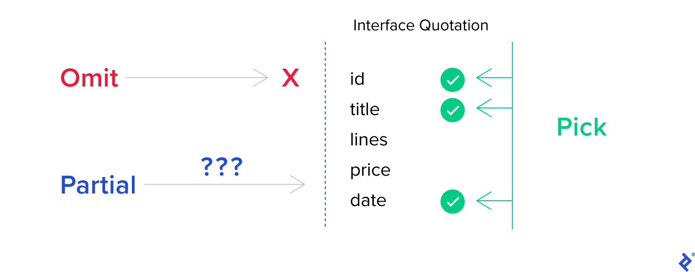

<!-- MarkdownTOC levels="2,3" -->

- [useful features](#useful-features)
- [how React hooks work with TypeScript](#how-react-hooks-work-with-typescript)
- [declare](#declare)
- [结合React Ref 进行使用](#%E7%BB%93%E5%90%88react-ref-%E8%BF%9B%E8%A1%8C%E4%BD%BF%E7%94%A8)
- [对dom节点进行类型断言](#%E5%AF%B9dom%E8%8A%82%E7%82%B9%E8%BF%9B%E8%A1%8C%E7%B1%BB%E5%9E%8B%E6%96%AD%E8%A8%80)
- [Basic](#basic)
  - [Data Types](#data-types)
  - [枚举](#%E6%9E%9A%E4%B8%BE)
  - [类型断言](#%E7%B1%BB%E5%9E%8B%E6%96%AD%E8%A8%80)
  - [泛型](#%E6%B3%9B%E5%9E%8B)
- [Concept Comparison](#concept-comparison)
  - [type vs interface](#type-vs-interface)
  - [.d.ts vs .ts](#dts-vs-ts)
- [Interface](#interface)
- [Class](#class)
- [function](#function)

<!-- /MarkdownTOC -->

## useful features

**thress features to reducing the noise**

三个方法去避免重复定义相似的类型，减少接口描述的噪音

- `Pick<T, 'x', 'y'>` 返回 T 内 x,y 的定义
- `Omit<T, 'x', 'y'>` 返回 T 内除了 x,y 的定义
- `Partial<T>` T 内任意 key 均可



## how React hooks work with TypeScript

**TypeScript with Class Component(Old React)**

在 class 组件内使用 TypeScript 通常很麻烦，因为需要同时定义 `props` 和 `state`，通常需要重复定义，具体可以[参看](#%E7%BB%93%E5%90%88react-ref-%E8%BF%9B%E8%A1%8C%E4%BD%BF%E7%94%A8)

**Benefits of TypeScript with Hooks**

从下面的例子可以看出，大多数 state 都是依赖 props 进行初始化，通过 Hooks 不需要显示地去定义 `state`，而是通过 Testprops 去进行检测

相对于 class 的用法， hooks 可以单独定义每一个 state，更加易用

```ts
interface Testprops {
  value: string
}

function Test({ value }: Testprops) {
  const [test, setTest] = useState(value)
  const [other, setOther] = useState(false)
}
```

## declare

`declare` 声明关键字用来暴露定义好的类型方法

相比于 interface 和 type，declare 更像是和外界联系的一个“彩虹桥”

```js
// 使用declare class描述一个类或像类一样的对象，类可以有属性和方法，就和构造函数一样
declare class Greeter {
    constructor(greeting: string);

    greeting: string;
    showGreeting(): void;
}
```

## 结合React Ref 进行使用

注意，声明方法放在 class 组件最外层

```js
import React from 'react';

interface DrawerViewProps {
  // statements
}

interface DrawerViewState {
  // statements
}

class DrawerForm extends React.PureComponent<DrawerViewProps, DrawerViewState> {
    // ts 声明 myRef 类型
    myRef: React.RefObject<Input> | null;
    constructor(props) {
        this.myRef = React.createRef();
    }

    render() {
        return (<Input ref={this.myRef} placeholder={`${assets.add} ${assets.title}`} size='small' />);
    }
}
```

## 对dom节点进行类型断言

对于直接获取的dom节点，如果不进行类型断言，则可能出现 `Property 'xxx' does not exist on type 'Element'` 等错误

```js
// 对于单个节点，如果是input元素
let node = document.querySelector('#title') as HTMLInputElement;

// 对于多个节点
let list = document.querySelectorAll(".block") as NodeListOf<HTMLElement>;
```

## Basic

TypeScript 是作为 JavaScript 的一个超集存在，这意味着 JavaScript 中能够使用的方法在 TypeScript 内同样适用

TypeScript的核心原则之一是对值所具有的结构进行类型检查

推荐使用 `let` 和 `const` 来声明变量，作为变量的话使用 `const`，作为属性的话，使用 `readonly`

### Data Types

**基本类型**

```typescript
// 布尔值
let a: boolean = false

// 数字，支持整数，浮点数，其他进制字面量
let a: number = 6

// 字符串 
let a: string = "123"

// 对象，关键字是对象或者像 swift 一样使用 {} 简写，更推荐后者
let a: object = {} 或者 let a: {} = {}

// 数组，可以使用 [] 或者泛型
let a: number[] = [1,2,3] 或者 let a: Array<number> = [1,2,3]
```

**特殊类型**

- `any` 来标记某些变量不需要进行类型检查，相当于后门，用来关闭类型检查
- `void` 表示没有任何类型，通常用来表示函数的返回值
- `null` 和 `undefined` 只能赋值给 void 和它们自身，项目内不太常见
- `never` 表示用不存在的值的类型，例如抛出异常，不会有返回值额函数表达式和箭头函数表达式的返回值类型


**联合类型**

使用 `|` 来分隔基本类型，表示属性为多种类型之一，常见的就是函数形参接受字符串数组或者字符串，例如 `string[] | string`

可以发现，基本类型都是小写

### 枚举

关键字`enum`，枚举类型是对JavaScript标准数据类型的一个补充

使用枚举可以清晰地表达意图或创建一组有区别的用例

TypeScript支持数字的和基于字符串的枚举

```typescript
// 数字枚举
// 其余成员会从 1 开始自增
// 默认情况下，从 0 开始赋值，但是也可以手动为每个成员赋值
enum Color {Red = 1, Green, Blue}
let c: Color = Color.Red;
let d: string = Color[2];

// 字符串枚举
// 不能自增
enum Name {
    Ylone: "ylone";

}
```

枚举成员通过分号进行分隔


### 类型断言

关键词是 `as`，例如通过 `let strLength: number = (someValue as string).length;` 来断言 someValue 是一个 string 类型，告诉 typescript 编译器，很清楚自己在做什么操作

### 泛型

在计算机科学中，许多算法和数据结构并不会依赖于对象的实际类型。然而，你仍然会想在每个变量里强制提供约束

```typescript
function reverse<T>(items: T[]): T[] {
  const toreturn = [];
  for (let i = items.length - 1; i >= 0; i--) {
    toreturn.push(items[i]);
  }
  return toreturn;
}

// 接口
interface Array<T> {
  reverse(): T[];
}
```

泛型会根据传入来自动推断类型，并保持该类型


## Concept Comparison

### type vs interface

在 TypeScript 内，有两种方式来定义类型：type alias(类型别名)和interface(接口)

**不同点**

根据官方文档，两者区别在于：**不同于 interface 只能定义对象类型， type 声明的方式可以定义组合类型，交叉类型，原始类型**
1. interface 方式可以实现接口的 extends 和 implements ， 而 type alias 则不行。
2. interface 可以实现接口的 merge（即声明合并，声明同一个名字的接口会自动合并） ，但 type alias 则不行

```typescript
// 基本类型别名
type Name = string

// 联合类型
interface Dog {
    wong();
}
interface Cat {
    miao();
}

type Pet = Dog | Cat

// 具体定义数组每个位置的类型
type PetList = [Dog, Pet]
```

**相同点**

两者都允许扩展运算

```typescript
// interface extend
interface Name { 
  name: string; 
}
interface User extends Name { 
  age: number; 
}

// type &
type Name = { 
  name: string; 
}
type User = Name & { age: number  };
```

### .d.ts vs .ts

`.ts` 文件最终会被编译成 `.js` 文件，此时类型信息就会丢失，因此ts编译器就会自动根据 `.ts` 中信息来生成对外的 `.d.ts` 文件，用来搭配生成的 `.js` 文件使用。
其中，`.js` 文件是给运行引擎使用，而 `.d.ts` 是给IDE写代码时参考用的

`.d.ts` 就是 TypedDefinition 类型定义文件，用来定义类型信息以及接口规范


## Interface

接口是 TypeScript 中的一个核心概念，它用来将多个类型声明合并至一个类型声明，并且不必关心接口内属性的组织顺序

**基本使用**

```typescript
/**
 * Interface 内各个属性通过 `;` 进行分隔
 * `[propName: string]: any;` 来添加一个字符串索引签名
 * 表示的是该interface可以有任意数量的属性，并且只要它们不是其他已经定义的属性，那么就无所谓它们的类型是什么
 */
interface Test {
    x: string;
    y?: string;
    readonly z: number;
    [propName: string]: any;
}

let test: Test = {
    x: "x",
    z: "z"
}
test.z = "newz" -> error
```

通过 `readonly` 关键字来标记某个属性为**只读属性**，表示该属性只能在创建时设置值，一旦赋值，则不能再更改

接口内可以通过 `?` 来标记某个属性为**可选属性**，它用来表示该属性不是必须的，两个好处：

- 可以对可能存在的属性进行预定义
- 可以捕获引用了不存在的属性时的错误

**接口添加属性和接口的继承**

```swift
interface A {
    a: number
}

/**
 * 声明同名接口来实现接口的重写
 * 注意区别接口重写，一个是修改原接口定义，一个是创建一个新的接口
 */
interface A {
    b: number
}
let a: A = {
    a: 1,
    b: 2
}

/**
 * 通过 extends 关键字来实现接口继承
 * 继承可以更灵活地将接口分割到可重用的模块里，并且一个接口可以继承至多个接口
 */
interface B extends A {
    c: number
}
let b: B = {
    a: 1,
    b: 2,
    c: 3
}

/**
 * 通过 `implements` 强制类来符合接口定义
 * 比如定义了一个方法，则必须在 class 内实现该方法，属性同理
 */
class C implements A {
    a: 1;
    b: 2;
}
```


## Class

TypeScript 中类时使用同 ES6

从某种角度上看，类具有 **静态部分** 和 **实例部分** 两部分
- 静态部分：类本身，static
- 实例部分：类成员，public，private，protected，需要实例化（即使用 new 关键字）

几个注意点：
- 通过 `extends` 来实现类的继承
- 子类如果有构造函数 `constructor()` ，那么其必须调用 `super()` 来执行基类的构造函数，而且，在构造函数里访问 this 属性之前，一定要调用 `super()`
- 可以在子类重写基类的方法，生成子类实例时会调用子类的方法
- 在 TypeScript 内，默认所有成员都是 `public`，不需要显示声明
- 当成员被标记为 `private` 时，则不能在**声明它的类的外部**进行访问
- `protected` 修饰的属性或方法是受保护的，它和 `private` 类似，区别是它在子类中也是允许被访问的
- 对于 `private` 和 `protected` 成员，如果两个类中同时定义了同一私有或者保护成员，则这两个类是不兼容的，即不能直接将一个类的实例赋值给另一个类
- `readonly` 关键字用来将属性设置为只读的，只读属性只能在声明时或者构造函数内被初始化
- 存取器，即成员变量的 `get` 和 `set` 方法，只带有get不带有set的存取器自动被推断为readonly
- `static` 是静态属性的关键字，用来将属性绑定至类本身
- 抽象类的关键字 `abstract`，用来声明抽象类，一般不用来进行实例化操作，作用和语法都类似接口，不过抽象内里面可以使用 `private` 等修饰符

`private`, `public`, `protected` 作用于类的实例成员，仅当类被实例化时才会初始化这些属性，不同于类的静态属性，静态属性绑定在类本身


## function

注意区分函数类型和函数返回值类型

如下所示，通过一个变量来承载一个匿名函数，需要为该变量设置其函数类型，同时要给该匿名函数的形参和函数返回值设置类型

注意，有默认值的形参，在函数类型时与可选类型属于同类

```typescript
/**
 * 综合用法
 * 在声明函数时需要考虑到输入和输出类型，在JavaScript的基础上，为形参添加类型
 * TypeScript能够根据返回语句自动推断出返回值类型，因此我们通常省略它
 * 如果带默认值的参数出现在必须参数前面，用户必须明确的传入`undefined`值来获得默认值
 * 函数形参的传递顺序，必选参数>带默认值的参数>可选参数
 */
function sum(x: number, y: number = 1, c?: number): number {
    return x + y;
}

let result = sun(1, undefined);

/**
 * 函数表达式
 * 函数类型返回值的关键字是 =>，必须声明返回值类型，如果函数没有返回任何值，则返回值类型为void
 * 不要混淆了 TypeScript 中的 => 和 ES6 中的 =>
 */
let mySum: (x: number, y: number) => number = function (x: number, y: number): number {
    return x + y;
};

// 利用接口定义函数的形状
interface SearchFunc {
    (source: string, subString: string): boolean;
}

let mySearch: SearchFunc;
mySearch = function(source, subString) {
    return source.search(subString) !== -1;
}

/**
 * 在JavaScript里，你可以使用 arguments来访问所有传入的参数
 * 在 TypeScript 内通过 `...restName: string[]` 的形参来接受剩余参数，关键是三点运算符 `...`
 */
function test(first: string, ...restOfName: string[]) {
  return first + " " + restOfName.join(" ");
}
test("a", "b", "c")
```

