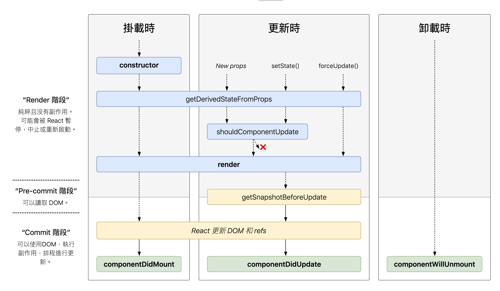

<!-- MarkdownTOC -->

- [JSX](#jsx)
- [State](#state)
	- [state的一些冷知识](#state%E7%9A%84%E4%B8%80%E4%BA%9B%E5%86%B7%E7%9F%A5%E8%AF%86)
- [组件](#%E7%BB%84%E4%BB%B6)
	- [受控组件和非受控组件](#%E5%8F%97%E6%8E%A7%E7%BB%84%E4%BB%B6%E5%92%8C%E9%9D%9E%E5%8F%97%E6%8E%A7%E7%BB%84%E4%BB%B6)
	- [class 组件转换为 function](#class-%E7%BB%84%E4%BB%B6%E8%BD%AC%E6%8D%A2%E4%B8%BA-function)
	- [constructor](#constructor)
	- [组件的生命周期](#%E7%BB%84%E4%BB%B6%E7%9A%84%E7%94%9F%E5%91%BD%E5%91%A8%E6%9C%9F)
	- [组件通信](#%E7%BB%84%E4%BB%B6%E9%80%9A%E4%BF%A1)
- [事件绑定](#%E4%BA%8B%E4%BB%B6%E7%BB%91%E5%AE%9A)
	- [bind this](#bind-this)
	- [条件渲染](#%E6%9D%A1%E4%BB%B6%E6%B8%B2%E6%9F%93)

<!-- /MarkdownTOC -->

> React 是一个用于构建用户界面的JavaScript库

## JSX

JavaScript 的语法扩展，执行更快，编译过程就能过滤出一些错误

在 react 中，所有的元素都是 object，区别于浏览器的 DOM 元素

React DOM 用来识别 JSX，将其转换为 object，然后渲染出来，并确保两者保持一致

React Dom 使用**驼峰命名法（camelcase）**来定义属性或者内联样式，这点区别于 HTML

值得一提，React DOM 在渲染之前都会过滤传入的值，将其转换成字符串来有效防范注入攻击

```jsx
// 特例字典，只要原因是处理 javascript 内的保留字
let dict = {
	class: 'className',
	tabindex: 'tabIndex',
	for: 'htmlFor',
	// 事件绑定
	onclick: 'onClick',
}

function Jsx() {
	return (
		{/** htmlFor - for **/}
		{/** tabIndex - tabindex **/}
		<div className='jsx' tabIndex={tabIndex} htmlFor={htmlFor} onClick={onClick}>

		{/** 条件判断 **/}
		{arr.length &&
			<div>...</div>
		}

		{/** 三元表达式 **/}
		{arr.length > 0 ?
			<div>True</div> : <div>False</div>
		}

		{/** 循环 **/}
		{list.map(item => {
			return (<div key={item.key}>item</div>)
			})
		}
		</div>
	);
}
```


## State

不可以在 react `render()` 方法内使用 `this.setState()`，因为无论何时调用 `setState()` 方法后都会调用 `render()`，如果在 `render()` 内调用 `setState()` 方法，会陷入一个死循环

react 将组件视为状态机，state 的改变会触发组件的重新渲染

不能通过直接赋值 `this.state.data` 来改变 state 值，而是统一通过 `setState()` 来改变，因为React的动态绑定不是通过数据劫持来实现的，而是配合diff算法

React 会将多个 `setState()` 调用合并成一个，因此**State 的更新可能是异步的**，如果需要依赖 props 来更新 state，可以通过传入函数回调的办法来解决

```js
// state 为上一个 state
// props 为当前的 props
this.setState((state, props) => ({
  counter: state.counter + props.increment
}));
```

### state的一些冷知识

执行`setState()`一定会触发render()方法吗，这里针对class组件和react hook组件来实验两种特殊情况：

- 对于 class组件，`setState(null)` 和 `setState(sameValue)`（即传入相同的值）并不会触发render()方法，因为它在调用setState()时，是进行合并操作
- 对于 react hook组件，上面两种情况均会触发render()方法，因为它是替换操作，即只要调用了state重新赋值的方法，就一定会调用render()方法


## 组件

> 组件允许你将 UI 拆分为独立可复用的代码片段，并对每个片段进行独立构思

组件声明：

- 组件本质上是一个函数对象，所以可以通过函数式来声明或者通过ES6的 class 来创建
- 使用类来创建就允许我们使用React其它特性，例如局部状态state、生命周期钩子
- 组件名称必须以大写字母开头
- 组件返回值只能有一个根元素，因此组件在创建时一般用一个 `<div>` 标签来包裹
- 注意所有的React组件必须像纯函数（即输入对应输出）那样使用它们的props，这意味着 props 获取的属性值是只读的

```javascript
// 一个 react 的组件模版，常用的生命周期函数
import React from "react";

class Test extends React.Component {
	// 添加状态
	constructor(props) {
		super(props);
		this.state = {
			// javascript object
		}
		this.handleClick = this.handleClick.bind(this)
	}

	// 纯函数，返回渲染内容
	render() {
		// some deals
		return (
			<div>
			// dom element
			</div>
		)
	}

	// 组件被插入到 dom 结构中
	componentDidMount() {
		// statement
	}

	/**
	 * 组件发生更新之后，重新渲染完成
	 * 首次渲染不会执行
	 * 需要在条件语句内调用 setState 方法，避免死循环
	 */
	componentDidUpdate(prevProps) {
		if (this.props.user !== prevProps.user) {
			// this.setState(...)
		}
	}

	// 组件从 dom 结构中移除，此时不能够调用 setState()，因为该组件永远不会重新渲染
	componentWillUnmount() {
		// statement
	}

	// 自定义事件
	event = (data) => {
		//statement
	}
}

export default Test
```

### 受控组件和非受控组件

如果一个组件被父级传入的 props 控制，则可以认为该组件是受控的

如果数据仅仅保存在组件内部的 state，则该组件是非受控组件，因为外部无法直接控制 state


### class 组件转换为 function

对于纯函数组件，即输入决定输出，输出映射输入的函数，能够进行响应的转换，对比 class 声明组件方式：

- 不需要声明周期函数，直接 `return` jsx template
- 自定义函数声明方式改变

```javascript
function Test(props) {
	const event = (data) => {
		//statement
	};

	return(
		<div className={props.className}>
		// dom element
		</div>
	);
}
```

### constructor

组件内的构造函数，有几点需要特别注意：

- 用来初始化组件，在其内部进行 state 初始化，来避免调用 setState() 而触发的额外渲染
- constructor 内必须调用 `super(props)`，否则无法使用 `this` 对象，它用来调用基类的构造方法，同时将父组件的 props 注入到子组件内
- 如果不初始化 state 或者不进行方法绑定，则不需要为组件实现其构造函数 


### 组件的生命周期

React 的生命周期经过了一次迭代，这里记录 React V16 之后的版本



React 生命周期的不同阶段，可以从横向和纵向来分别进行理解，下面重点对**横向比较**进行理解：

1. 挂载阶段，可以理解成组件初始化阶段，即将组件插入到DOM中，只会发生一次
2. 更新阶段，当组件的props改变了，或组件内部调用了setState或者forceUpdate发生，会多次发生
3. 卸载阶段，组件被卸载或者销毁时调用，可以去清除一些定时器，取消网络请求，清理无效的DOM元素等垃圾清理工作，此时调用 setState() 不会生效

在**挂载阶段**，其生命周期函数调用：

- constructor
- static getDerivedStateFromProps
- render，纯函数，返回渲染内容
- componentDidMount，存放业务逻辑，组件装载之后调用，此时可以获取到DOM节点并操作

在**更新阶段**，其生命周期函数调用：

- static getDerivedStateFromProps
- shouldComponentUpdate，返回布尔值来表示是否需要更新组件，当调用 forceUpdate 并不会触发此方法
- render
- getSnapshotBeforeUpdate
- componentDidUpdate

在**卸载阶段**，其生命周期函数调用：

- componentWillUnmount

getDerivedStateFromProps(props, state)是一个静态方法，因此不能使用 this，其有两个参数，返回一个对象来更新当前的 state，如果不需要更新则返回 null，尽量不要使用该方法，会造成组件难以维护

- 如果你需要执行副作用（例如，数据提取或动画）以响应 props 中的更改，请改用 componentDidUpdate
- 如果只想在 prop 更改时重新计算某些数据，请使用 memoization helper 代替
- 如果你想在 prop 更改时“重置”某些 state，请考虑使组件完全受控或使用 key 使组件完全不受控 代替

```js
import React from 'react';

class Test extends React.Component {
	constructor(props) {
		super(props);
	}

	/**
	 * 在 render() 方法之前调用，并且在挂载和更新时都会调用
	 * 该生命周期存在的唯一目的就是：使用派生 state 时，即当 props 改变时，引起 state 的变化
	 * 派生状态会导致代码冗余，并使组件难以维护，因此一般都使用替代方案
	 */
	static getDerivedStateFromProps(props, state) {

	}

	/**
	 * 手动判断当前组件是否需要更新
	 * 当 props 和 state 发生改变时调用，挂载阶段和 forceUpadte() 不会触发此生命周期
	 * 此方法仅作为性能优化的方式存在，不要试图通过此方法来阻止渲染
	 * return false 并不会阻止子组件在 state 更新时重新渲染
	 */
	shouldComponentUpdate(nextProps, nextState) {
		return true;
	}
}
```


### 组件通信

父组件使用子组件方法

- 将子组件 this 作为参数传递给父组件，父组件通过 `this.child` 来挂载（这样有点暴力）
- 更好的方式是通过，父组件将包含`setState()` 的方法传递给子组件，子组件通过 `this.props` 来调用该方法
- 通过 `this.myRef = React.createref()` 和 `ref={this.myRef}` 将 ref 挂载至子组件，从而获取子组件的对象实例，完成通信，[相关链接](./b.advanced.md#context)

子组件使用父组件方法，直接将父组件定义好的方法传递给子组件，子组件通过 `this.props` 来访问方法

- 数据单向传递

兄弟组件通信

- 可以将数据挂载至其最近父组件上来进行访问
- 还可以利用第三方库，比如 redux 来对系统内通信进行统一管理

跨级组件通信

- 通过组合组件将深层组件通过 props 进行传递
- 通过 context 来进行组件通信，[相关链接](./b.advanced.md#ref)
- 还可以利用第三方库，比如 redux 来对系统内通信进行统一管理 

```javascript
// 子组件
class Child extends Component {
	componentDidMount() {
	   this.props.onRef(this);
  	}
  	...
}

// 父组件
class Parent extends Component {
	onRef = (ref) => {
	   this.child = ref;
	}

	// 调用
	submit = () => {
	    // this.child...
	 }

	render() {
		return (
			<Child onRef={ this.onRef }>
		)
	}
}

```


## 事件绑定

直接绑定到 JSX 元素上，类似 dom 元素事件绑定，传入一个函数方法而不是一个字符串

camelcase，即（`onClick` 而不是 `onclick`）

不能通过 `return false;` 来阻止元素的默认行为（比如 `<a>` 标签），而是通过 `e.preventDefault()` 来实现

### bind this

通常情况下，如果你没有在方法后面添加 `()`，则需要为该方法绑定 `this`

在 ES6 中，class 是不会默认绑定 `this` 的，有三种方法为其绑定：

通过 ES6 的箭头函数

```javascript
class EventHandle extends React.Component {
  handleClick() {
    console.log('this is:', this);
  }

  render() {
    return (
		// data 为传参，可不传
      <button onClick={(e) => this.handleClick(data, e)}>
        Click me
      </button>
    );
  }
}
```

2. 通过 `bind()` 方法，利用 `function.prototype.bind` 方法

- 在 constructor 内通过 bind 绑定 this
- 元素内直接绑定 this

```javascript
class EventHandle extends React.Component {
  constructor(props) {
    super(props);
    // 在 constructor 内通过 bind 绑定 this
    this.handleClick = this.handleClick.bind(this);
  }

  handleClick() {
    onsole.log('this is:', this);
  }

  render() {
    return (
    	// 或者直接绑定 
    	// <button onClick={this.handleClick.bind(this, data)}>
    	// data 为传参，可选
      <button onClick={this.handleClick}>
        Click me
      </button>
    );
  }
}
```

通过实验方法来绑定，`creat-react-app` 内默认使用

```javascript
class EventHandle extends React.Component {
  // 这个语法保证 this 绑定到 handleClick 方法上
  // Warning: 试验性方法
  handleClick = () => {
    console.log('this is:', this);
  }

  render() {
    return (
      <button onClick={this.handleClick}>
        Click me
      </button>
    );
  }
}
```


### 条件渲染

通过判断来渲染组件，主要方法有三：

1. if 语句
2. && 运算符
3. 三元表达式

**阻止组件渲染**

在一些情况下，希望组件不被渲染，一个办法就是：在 `render()` 方法内通过 `return null;` 来实现，但是需要注意：
组件在 `render()` 方法内返回 null 并不会影响组件声明周期方法的回调，即生命周期方法仍可以被调用


