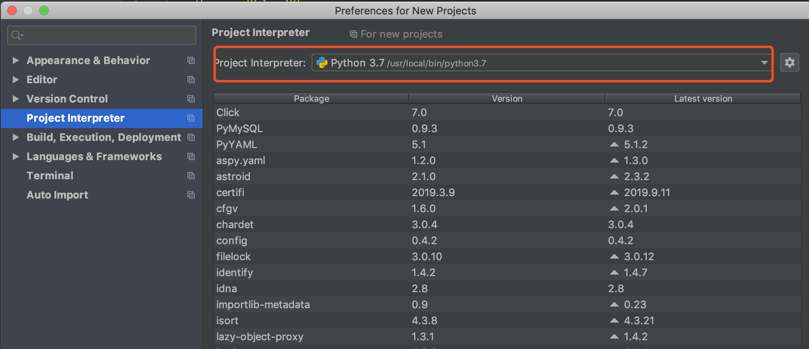

<!-- MarkdownTOC -->

- [Trivia](#trivia)
- [System](#system)
	- [Mac vscode python 版本问题](#mac-vscode-python-%E7%89%88%E6%9C%AC%E9%97%AE%E9%A2%98)
	- [pyCharm 代码补全功能消失](#pycharm-%E4%BB%A3%E7%A0%81%E8%A1%A5%E5%85%A8%E5%8A%9F%E8%83%BD%E6%B6%88%E5%A4%B1)
	- [SystemError: error return without exception set](#systemerror-error-return-without-exception-set)
- [文件操作](#%E6%96%87%E4%BB%B6%E6%93%8D%E4%BD%9C)
	- [去除文件内空白字符](#%E5%8E%BB%E9%99%A4%E6%96%87%E4%BB%B6%E5%86%85%E7%A9%BA%E7%99%BD%E5%AD%97%E7%AC%A6)
- [import file](#import-file)

<!-- /MarkdownTOC -->

## Trivia

1. `from collections.abc import Iterable` 3.6之前的版本是不需要带.abc的，3.7之后就会提示需要加.abc了，3.8会直接报错
2. 判断元素是否在 dict 或者 list 内 `element in dict`，返回 true or false 

## System

> 记录 system 和 ide 引起的问题

### Mac vscode python 版本问题

`python -V` 查看当前 python 版本

`python3 -V` 查看 python3 版本

`which python3` 查看当前 python3 安装路径$path

`cmd - shift - p` 输入 `user settings` 打开用户配置

搜索关键字 `pythonpath`,将 $path 写入后保存

此时在 terminal 内通过 `python test01.py` 仍以 python2.7 运行

正确运行方法双击文件 `test01.py`,选择**在终端运行python文件** 或者在文件目录执行 `python3 test01.py`

### pyCharm 代码补全功能消失

通常在长期不用之后发生，解决办法：

- file - power save mode 去掉前面的对勾
- file - other settings - preferences for new project - project interpreter 

### SystemError: error return without exception set

在 pycharm 内执行 insert sql 之后出现

解决办法：在 Run - Edit Configurations 中添加Environment variable：`PYDEVD_USE_FRAME_EVAL=NO`

## 文件操作

打开文件的模式

1. 只读模式（默认）
2. 只写模式（不可读，不存在则创建，存在则覆盖）
3. 追加模式（可读，不存在则创建，存在则只追加内容）

'+' 表示可以同时读写某个文件

1. `r+` 可读写文件（可读，可写，可追加）
2. `w+` 写读
3. `a+` 追加

`U` 用来兼容不同系统的换行操作，将其全转换成 `\n`

### 去除文件内空白字符

`string.strip()` 去除首尾的空白字符，比如`\n\t\t` 和空格

通过 `replace()` 来去除字符串内所有的空白字符串，`string.replace('\t', '').replace('\n', '').replace('\r', '')`

## import file

1. 当需要导入的文件在同级目录下时，直接导入即可；

2. 当需要导入的文件不在同级目录，需要通过相对路径引入，一个比较通用的办法就是，将相对路径添加到系统路径
