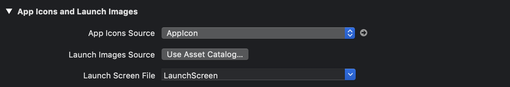

<!-- MarkdownTOC levels="2,3" -->

- [System](#system)
    - [通过 Xcode 来检查当前手机的 log](#%E9%80%9A%E8%BF%87-xcode-%E6%9D%A5%E6%A3%80%E6%9F%A5%E5%BD%93%E5%89%8D%E6%89%8B%E6%9C%BA%E7%9A%84-log)
    - [点击 Today widgets，跳转到 app 内指定页面](#%E7%82%B9%E5%87%BB-today-widgets%EF%BC%8C%E8%B7%B3%E8%BD%AC%E5%88%B0-app-%E5%86%85%E6%8C%87%E5%AE%9A%E9%A1%B5%E9%9D%A2)
    - [系统自定义换肤功能实现](#%E7%B3%BB%E7%BB%9F%E8%87%AA%E5%AE%9A%E4%B9%89%E6%8D%A2%E8%82%A4%E5%8A%9F%E8%83%BD%E5%AE%9E%E7%8E%B0)
- [iOS13 兼容 DarkMode](#ios13-%E5%85%BC%E5%AE%B9-darkmode)
    - [Basic](#basic)
    - [Use In Project](#use-in-project)
- [StoryBoard](#storyboard)
    - [为 app 启动页设置图片展示](#%E4%B8%BA-app-%E5%90%AF%E5%8A%A8%E9%A1%B5%E8%AE%BE%E7%BD%AE%E5%9B%BE%E7%89%87%E5%B1%95%E7%A4%BA)
- [KeyBoard](#keyboard)
    - [UITextField 点击空白处隐藏键盘](#uitextfield-%E7%82%B9%E5%87%BB%E7%A9%BA%E7%99%BD%E5%A4%84%E9%9A%90%E8%97%8F%E9%94%AE%E7%9B%98)
    - [获取键盘弹起高度](#%E8%8E%B7%E5%8F%96%E9%94%AE%E7%9B%98%E5%BC%B9%E8%B5%B7%E9%AB%98%E5%BA%A6)
    - [全局监听键盘弹起事件](#%E5%85%A8%E5%B1%80%E7%9B%91%E5%90%AC%E9%94%AE%E7%9B%98%E5%BC%B9%E8%B5%B7%E4%BA%8B%E4%BB%B6)
- [BindEvent](#bindevent)
    - [为UIImageView等无事件视图添加事件绑定](#%E4%B8%BAuiimageview%E7%AD%89%E6%97%A0%E4%BA%8B%E4%BB%B6%E8%A7%86%E5%9B%BE%E6%B7%BB%E5%8A%A0%E4%BA%8B%E4%BB%B6%E7%BB%91%E5%AE%9A)
- [Image](#image)
    - [添加背景图](#%E6%B7%BB%E5%8A%A0%E8%83%8C%E6%99%AF%E5%9B%BE)

<!-- /MarkdownTOC -->


> 用来记录在使用Swift4进行实际开发过程中遇到的综合性较强的方案实现


## System

> 记录系统相关问题

### 通过 Xcode 来检查当前手机的 log

1. 打开Xcode，手机连接至 Mac
2. `Window > Device and Simulator`
3. 点击 `open console`


### 点击 Today widgets，跳转到 app 内指定页面

主要利用以下 api 来进行实现：
- `self.extensionContext?.open(URL(string:), completionHandler: {...})`
- `func application(_ app: UIApplication, open url: URL, options: [UIApplication.OpenURLOptionsKey : Any] = [:]) -> Bool{...}`

下面介绍具体的代码实现：

`TodayServiceViewController` 用于监听点击事件，拼接并传递URL

```swift
/**
 * 用于承载点击事件，添加事件监听
 * 下面列举关键代码
 */
override func viewDidLoad() {
    super.viewDidLoad()
    // statement
    NotificationCenter.default.addObserver(self, selector: #selector(self.openUrlContainingApp), name: NSNotification.Name(rawValue: "GameDidSelect"), object: nil)
}

// 跳转的关键方法，通过 url 来传递参数
@objc func openUrlContainingApp() {
    self.extensionContext?.open(URL(string: "xxx://rank?\(TodayService.selectedGame!.gameId)")!, completionHandler: { success in
        print(success)
    })
}

// 点击 tableCell 后 post 事件
func tableView(_ tableView: UITableView, didSelectRowAt indexPath: IndexPath) {
    let game = data[indexPath.row]
    TodayService.selectedGame = game
    NotificationCenter.default.post(name: Notification.Name(rawValue: "GameDidSelect"), object: nil)
}
```

`AppDelegate` 内用于接受 URL 并执行相应的操作，将重定向的 URL 信息进行缓存

```swift
func application(_ app: UIApplication, open url: URL, options: [UIApplication.OpenURLOptionsKey : Any] = [:]) -> Bool {
    var redirect = url.absoluteString
    // 如果以指定字符串开头，则将其进行格式化处理
    if redirect.hasPrefix("xxx://") {
        redirect.replaceFirst(matching: "xxx://", with: "")  
        MainService.redirectTo = redirect
    }
}
```

`TabViewController` 在 viewWillAppear 方法内根据有无 MainService.redirectTo 来执行相应的重定向操作

```swift
override func viewWillAppear(_ animated: Bool) {
    super.viewWillAppear(animated)
    
    // statement
    if !MainService.redirectTo.isEmpty {
        if MainService.redirectTo.hasPrefix("rank") {
            self.selectedViewController = self.viewControllers![0]
            // 如果需要重定向到具体的详情页，则可以继续进行相应处理，这里不再展开
            if MainService.redirectTo.contains("?") {
                let currentValue = MainService.redirectTo.components(separatedBy: "?")[1]
                MainService.redirectGameId = currentValue
            }
        }
    }
}
```


### 系统自定义换肤功能实现

换肤功能**实现原理**：

1. 在全局声明一个 Theme 类，在各个 viewController 内不再使用 UIColor，而是使用 Theme 内封装的颜色
2. 新建一个 ThemeSetting 类用于封装换肤相关的方法，当用户进入系统或者使用换肤功能时，调用该类来实现全局换肤
3. 在换肤页面需要声明一个方法来适配触发换肤方法后的主题颜色，即 `renderWithTheme`

```swift
/**
 * Theme 类
 * 用于映射不同主题的不同颜色
 */
public class UTheme {
    public static var type = "dark"

    @objcMembers
    public class color: NSObject {
        static var tint: UIColor = .white
        static var tintBackground: UIColor = .white
        static var background: UIColor = UIColor(hexString: "f4f4f4")
        // statement
    }
    // statement
}
```

```swift
/**
 * ThemeSetting 类
 * 封装主题相关方法，比如当前主题，主题切换等
 */

import Foundation
import SwiftyJSON

class ThemeCreator {
    static var themes: [String] = []
    static var themeNames: [String: String] = [:]
    static let pathPrefix = "resource/theme/"
    static var current: String = "dark"
    static let notification = NSNotification.Name(rawValue: "ThemeDidChange")
    static var darkMode = "none"

    static public func setup(theme: String? = nil, _ mode: String = "none") {
        // 获取当前系统支持的主题
        themes = getThemes()
        if themes.isEmpty { return }
        if let t = theme, themes.contains(t) {
            // 如果在配置内，则使用该主题
            current = t
        } else {
            // 否则，默认使用第一个主题
            current = themes[0]
        }
        // 设置当前主题
        setTheme()
    }
    
    // 获取当前系统支持主题
    static private func getThemes() -> [String] {
        guard let data = getData("config", type: "json") else {
            return []
        }
        let json = try! JSON(data: data)
        
        var ts = [String]()
        themeNames = [:]
        for (_, item) in json["themes"] {
            if let t = item["type"].string, let n = item["name"].string {
                ts.append(t)
                themeNames[t] = n
            }
        }
        return ts
    }
    
    // 通过路径读取配置文件
    static private func getData(_ p: String, type: String) -> Data? {
        let path = pathPrefix + buildPath(p)
        
        if let path = Bundle.main.path(forResource: path, ofType: type) {
            do {
                let data = try Data(contentsOf: URL(fileURLWithPath: path), options: .mappedIfSafe)
                
                return data
            } catch {
                print(error)
            }
        }
        
        return nil
    }
    
    // 设置当前主题各个色值
    static private func setTheme() {
        guard let data = getData("themes/" + current + "/config", type: "json") else {
            return
        }
        UTheme.type = current
        
        // 获取当前主题的各个色值
        let json = try! JSON(data: data)

        // 将 json 文件内配置映射到 Utheme 类中
        for (key, value) in json["color"] {
            if let v = value.string, let _ = UTheme.color.value(forKey: key) as? UIColor {
                UTheme.color.setValue(UIColor(hexString: v), forKey: key)
                // statements
            }
        }
    }
}
```

主题配置文件

```json
// 系统支持所有主题
{
    "version": "1",
    "themes": [
        {"type": "green", "name": "绿"},
        {"type": "red", "name": "红"},
        {"type": "dark", "name": "黑"}
    ]
}

// 各个主题的颜色配置
{
    "color": {
        "systemTint": "#333",
        "tint": "#18c2c4",
        // statements
    }
}
```


## iOS13 兼容 DarkMode

项目开发背景：当前项目已经有一套换肤功能，需要兼容 iOS13 的 darkmode，因此添加 darkmode 下的皮肤，同时监听模式切换，通过调用之前的换肤方法来进行切换，正常来说需要在每个页面进行适配，但是出于记着上线和测试难度的问题，采用换肤后进行跳转的办法来进行页面刷新，从而达到目的

### Basic

适配iOS13新增的dark模式特性，适配主要基于：

- color，系统已经适配了颜色（即不设置颜色时），同时支持自定义动态颜色
- image，支持系统图标的切换，同时支持自定义的动态图标
- 监听模式变化，从而触发自定义事件
- 为模式变化添加 log

**获取当前模式**

在 UIView 或者 UIViewController 内通过 `traitCollection.userInterfaceStyle`(或者 `UITraitCollection.current.userInterfaceStyle`) 返回当前的模式，其值对应一个枚举

```swift
// userInterfaceStyle 是一个枚举，声明如下
public enum UIUserInterfaceStyle: Int {
	case unspecified
	case light
	case dark
}

/**
 * UIColor
 * 在 iOS13 之前，仅支持一种颜色，但是之后，提供一个回调方法，用来动态设置颜色
 */
var backColor: UIColor!
let label = UILabel()
backColor = UIColor(dynamicProvider: { (trainCollection) -> UIColor in
    if #available(iOS 13.0, *) {
        if UITraitCollection.current.userInterfaceStyle == .dark {
            return UIColor.black
        } else if UITraitCollection.current.userInterfaceStyle == .light {
            return UIColor.white
        }
    }
})
label.textColor = backColor

/**
 * 监听模式变化
 * 只会在当前 viewController 内触发，不会影响其他的 viewController
 * 在app进入后台和激活时都会触发该事件，且不会正确处理其darkmode，因此需要一个阀门来控制是否监测该事件
 */
override func traitCollectionDidChange(_ previousTraitCollection: UITraitCollection?) {
    super.traitCollectionDidChange(previousTraitCollection)
    if #available(iOS 13.0, *) {
        if traitCollection.hasDifferentColorAppearance(comparedTo: previousTraitCollection) {
            self.renderWithTheme()
        }
    }
}
```

**图片适配**


**添加log**

在 `Product > Scheme > Edit Scheme > Run > Arguments Passed On Launch` 设置 `-UITraitCollectionChangeLoggingEnabled YES` 

### Use In Project

在了解项目（所做的项目dark适配比较畸形，实际上是监听切换模式来设置不同主题，不是系统意义上的模式切换）背景和基础知识之后，接下来介绍项目内适配的注意事项

项目内所有的 viewController 都继承至一个基类，即 BaseViewController，因此需要在其内添加监听模式变化的方法，因为在切换主题之后会进行跳转，因此需要在指定跳转页面内添加 renderWithTheme 方法来重新渲染，为此，需要在BaseViewController内添加一个监听事件，当监听到模式切换时，会向各个页面通知其调用 renderWithTheme 方法

注意，在app进入后台时，也会触发模式切换的方法，因此需要一个阀门来控制其触发，目的是为了重新打开 app 时，能够不进行相应的页面跳转，这些适配主要是因为奇葩的需求（切换模式要跳转页面）

同时，观察到在切换主题时，监听事件并不会释放，只会在进入以缓存的当前页面进行释放，因此造成了一定程度上的内存泄漏，这个问题是由切换方案导致，不是由于新增 dark mode 导致

```swift
import UIKit

class BaseViewController: UIViewController {
    // 用于控制，在 app 进入后台时不会触发模式监听
     var isOpen = true

     override func viewDidLoad() {
        super.viewDidLoad()
        theme = ThemeCreator.current
        view.backgroundColor = UTheme.color.background
        NotificationCenter.default.addObserver(self, selector: #selector(viewDidBecomeActive), name: UIApplication.willEnterForegroundNotification, object: nil)
        NotificationCenter.default.addObserver(self, selector: #selector(viewWillResign), name: UIApplication.didEnterBackgroundNotification, object: nil)
        // 每个 viewController 都添加一个自定义监听事件
        Utils.NotificationCenter.addObserver(self, selector: #selector(obverThemeChange), name: NSNotification.Name("themeChange"), object: nil)
    }

    @objc func viewDidBecomeActive() {
        isOpen = true
    }
    
    @objc func viewWillResign() {
        isOpen = false
    }
    
    // 监听到主题切换事件后，触发renderWithTheme
    @objc func obverThemeChange() {
        renderWithTheme() 
    }

    // 监听模式变化
    override func traitCollectionDidChange(_ previousTraitCollection: UITraitCollection?) {
        super.traitCollectionDidChange(previousTraitCollection)
        if #available(iOS 13.0, *) {
            if traitCollection.hasDifferentColorAppearance(comparedTo: previousTraitCollection) {
                if isOpen {
                    // 初始化主题颜色
                    var currentMode = "none"
                    if self.traitCollection.userInterfaceStyle == .dark {
                        currentMode = "dark"
                    } else if self.traitCollection.userInterfaceStyle == .light {
                        currentMode = "light"
                    }
                    if currentMode != ThemeCreator.darkMode {                        
                        ThemeCreator.darkMode = currentMode
                        ThemeCreator.setup(theme: Setting.shared.theme, currentMode)
                        // 底部导航
                        if let tab = tabBarController as? TabViewController {
                            tab.renderWithTheme()
                            let originalTheme = Setting.shared.theme
                            if self.isDrakRedict {
                                if originalTheme == "darkGreen" || originalTheme == "darkRed" {
                                    // 跳转到当前根目录
                                    self.navigationController?.popToRootViewController(animated: true)
                                }
                            }
                        }
                        // 向全局监听器发送该事件
                        Utils.NotificationCenter.post(name: NSNotification.Name("themeChange"), object: nil)
                    }
                }
            }
        }
        
    }
}
```


## StoryBoard

### 为 app 启动页设置图片展示

1. 在 `app > general` 内，设置 App Icons and Launch Images 选项



2. 在 Assets.xcassets 资源文件内添加相应的启动页图片
3. 点击进入 LaunchScreen.storyboard，点击 `view`
4. 点击右上角 `Library` 图标，输入 `image`，选择 `ImageView`，并拖入视图区域
5. 选择刚刚拖入的 ImageView，点击右上角 `Size` 图标，设置其尺寸，点击右上角 `Attributes` 图标，选择图片
6. 重启app


## KeyBoard

> 记录键盘相关问题

### UITextField 点击空白处隐藏键盘

UITextField 在获取焦点时会自动弹起键盘，此时点击空白处不会让其失去焦点，因此需要手动添加事件来控制当前空间失去焦点

一个思路是，在触摸开始时取消指定控件作为第一响应者（即失焦）

`resignFirstResponder` 通知此对象已要求它在其窗口中放弃作为第一响应者的状态

```Swift
override func touchesBegan(_ touches: Set<UITouch>, with event: UIEvent?) {
	super.touchesBegan(touches, with: event)
    textField.resignFirstResponder()
    // 由于 UISearchBar 继承于 UITextField 实现，因此同样适用
    searchBar.resignFirstResponder()
}
```

特殊情况的处理：如果在输入框内自定义了一些 icon 来行使某些功能，点击时会先触发重写的 `touchesBegan` 方法，如果要避免某些视图的冒泡场景，一个解决思路就是，重写该视图类的 `touchesBegan` 方法来达到阻止冒泡的行为

```Swift
class UIImageViewWithoutTouchToSuper: UIImageView {
    override func touchesBegan(_ touches: Set<UITouch>, with event: UIEvent?) {
        // 什么都不做，则不会触发任何事件
    }
}
```

### 获取键盘弹起高度

动态获取键盘弹起的高度

```Swift
if let keyboardFrame: NSValue = note.userInfo? [UIResponder.keyboardFrameEndUserInfoKey] as? NSValue {
	// 获取当前键盘的 Rect
    let keyboardRectangle = keyboardFrame.cgRectValue
    // 获取当前键盘的原点
    let keyboardYAxis = keyboardRectangle.origin
}
```

### 全局监听键盘弹起事件

常用的键盘监听事件

- 键盘将要弹出 `UIResponder.keyboardWillShowNotification`
- 键盘将要隐藏 `UIResponder.keyboardWillHideNotification`
- 键盘弹出后立即触发 `UIResponder.keyboardDidShowNotification`
- 键盘隐藏后立即触发 `UIResponder.keyboardDidHideNotification` 

```Swift
// 添加观察者，监听键盘即将弹出事件
NotificationCenter.default.addObserver(self, selector: #selector(keyBoardWillShow(note:)), name: UIResponder.keyboardWillShowNotification, object: nil)

// 定义键盘将要弹起时执行事件
@objc func keyBoardWillShow(note: Notification) -> Void {
	// statement
}
```


## BindEvent

> 为控件添加自定义事件

### 为UIImageView等无事件视图添加事件绑定

有些视图本身是不能直接通过 `addTarget()` 来添加方法的，要为此类视图添加方法，一个解决思路是为其添加手势控制

```Swift
// isUserInteractionEnabled 确定忽略用户事件并从事件列队中删除
deleteIconView.isUserInteractionEnabled = true

// 定义手势控制
let singleTap: UITapGestureRecognizer = UITapGestureRecognizer(target: self, action: #selector(clearUserTextInput(_:)))
// numberOfTouchesRequired 触发事件需要的手指数
singleTap.numberOfTapsRequired = 1

// 为icon添加点击事件
deleteIconView.addGestureRecognizer(singleTap)
```


## Image

图片相关内容

### 添加背景图

1. 利用 `UIColor.init(patternImage: backImage!)`将原图作为背景，它始终按照原图大小进行展示
- 图片尺寸大于视图时，不会自动缩放
- 图片尺寸小于视图时，会自动平铺，占满整个视图，类似 CSS 的 repeat 效果

```Swift
let backgroundImageView = UIView()
let image = UIImage(named: "test")
let backgroundImage: UIColor = UIColor.init(patternImage: image!)
backgroundImageView.backgroundColor = backgroundImage
```

2. 利用 `view.layer.contents` 来展示
- 不管图片大小，其会自动缩放成视图大小进行展示
- 可以计算图片和设备的长宽比来设置视图的大小，从而保证图片不失真

```Swift
let backgroundImageView = UIView()
let image = UIImage(named: "test")
backgroundImageView.layer.contents = image?.cgImage
```