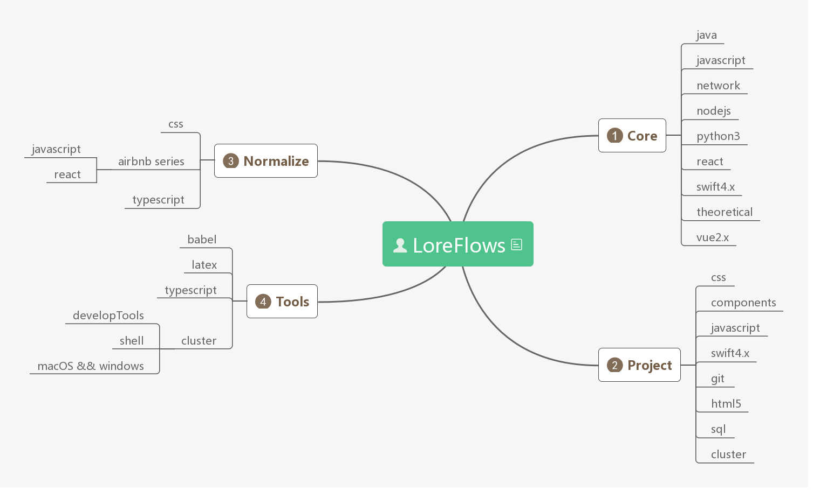

<!-- MarkdownTOC -->

- [LoreFlows](#loreflows)
- [流程](#%E6%B5%81%E7%A8%8B)
- [Purpose](#purpose)

<!-- /MarkdownTOC -->

## LoreFlows

对已接触知识进行梳理和分类，主要分为：

1. 核心知识，包括语法和基础知识
2. 标准化，积累知识在生产过程中的规范和标准
3. 项目，积累知识在实际应用过程中的使用方法和踩过的坑及其解决
4. 工具，在开发过程中学习的工具和语言编译器

## 流程

通过 vuepress 搭建的博客系统用来对当前项目进行系统化展示

博客系统用于展示，面向项目开发和知识复习，其内容源自于本项目，本项目内容的更改极大可能会引起博客系统内容的更改

在项目开发和知识复习过程中，如果发现有误，有所想或者有不合理的地方，第一阶段在博客系统上进行更改，之后回溯到本项目，对具体内容进行修正

博客系统是本项目的具体表现，本项目是知识源头，本项目是博客系统的产生，博客系统用来指导本项目进步

## Purpose

> Update on August 01,2019

1. 整理之前 github 文档，进行复看，对知识进行重新整理
2. 对知识进行分类
3. 工程化，对实际项目和运用过程中的问题进行整理
4. 系统化，对涉及知识点进行系统化归纳，举一反三是一件很酷的事情
5. 碎片化，保留每天的碎片化文档，进行归类
6. 对未来的笔记记录形式做一次更新

