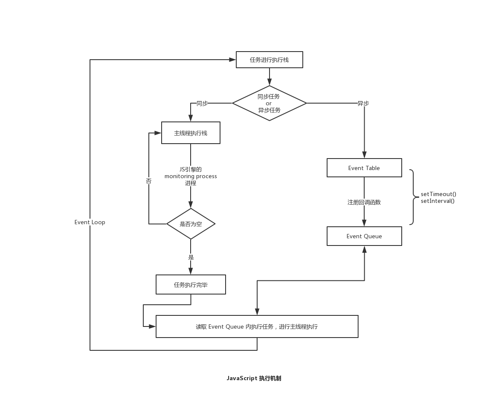
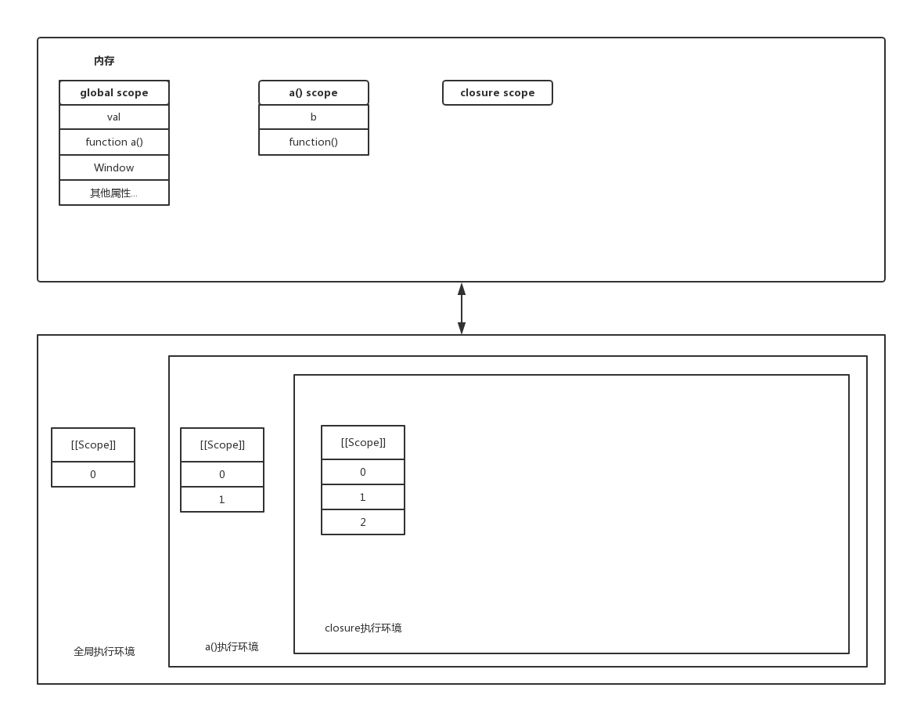

# JavaScript

## MVVM

MVVM的核心是数据驱动即ViewModel，ViewModel是View和Model的关系映射，怎么理解这句话？
- Model 层，用户从后端获取数据
- View 层，代表用户看到的视图
- ViewModel 则用来处理js对象和视图模版的映射关系，可以理解为数据的抽象画视图，ViewModel 充当着观察者的角色，当 view 或者 model 任一发生了改变，则会通知另一方作出相应的变化，即为数据的双向绑定

MVVM最标志的特性是数据绑定，MVVM的核心理念是通过声明式的数据绑定来实现View的分离，完全解耦View

## 执行机制

:::tip
JavaScript是一门单线程语言，事件循环（Event Loop）是 JavaScript 的执行机制
:::

在实际开发过程中，会经常用到

由于JavaScript引擎是单线程机制，它无法执行多段代码，当一段代码执行的时候，所有后续任务必须等待，从而形成一个任务队列。一旦当前任务完成，再从队列中取出下一个任务执行，这也被称为 ‘阻塞式执行’



- `setTimeout()` 设置的延迟参数是从 EventTable 中注册回调函数到 EventQueue 的时延，所有**执行其回调函数的时延 >= 其设置的时延**
- 即使主线程执行栈为空，0ms 实际上也是达不到的，根据HTML标准，最低是 4ms
- `setInterval()` 会每隔指定的时延将回调函数注册进入 EventQueue 中，一旦 `setInterval` 的回调函数的执行时间超过其设置的延迟，那么完全看不出来有时间间隔
- 除了广义的同步任务和异步任务，任务还有更加精细的定义
	- macro-task(宏任务)：正常执行script、setTimeout()、setInterval()
	- mirco-task(微任务)：Promise、process.nextTick(类似node.js版的setTimeout，其回调函数在事件循环的下一次循环中调用)

整体script作为第一个宏任务执行结束，会在 EventQueue 中检查还有哪些微任务，并对其依次执行，至此完成第一次 EventLoop，然后再在 EventQueue 内检查宏任务，进行 EventLoop

```javascript
console.log('1'); // 同步任务

// 整体作为一个异步任务
setTimeout(function() {
    console.log('5');
    process.nextTick(function() {
        console.log('7');
    })
    new Promise(function(resolve) {
        console.log('6');
        resolve();
    }).then(function() {
        console.log('8')
    })
});

// 异步任务-微任务，在下一次循环内执行
process.nextTick(function() {
    console.log('3');
});

// 微任务-微任务
new Promise(function(resolve) {
    console.log('2');
    resolve();
}).then(function() {
    console.log('4')
});

// 输出结果
// 即 Promise > nextTick > Promise.then
1,2,3,4,5,6,7,8
```

## 渲染关键路径

浏览器接收到服务器封装并返回的字节数据，将其进行解析并转换为像素的过程被称为**渲染关键路径**

缩短浏览器页面渲染时间的一个思路就是缩短渲染关键路径

1. 处理HTML标记数据并生成DOM树

2. 处理CSS标记数据并生成CSSOM树

3. 将DOM树和CSSOM树合并生成渲染树

4. 遍历渲染树，计算每个节点的位置信息，进行布局

5. 将每个节点绘制到屏幕

以上的步骤是一个**渐进**的过程，为了提高用户体验，渲染引擎会试图更快呈现渲染结果，这意味着它不会等到所有的HTML文件都被解析完才创建并布局渲染树，它会将先获得的文档内容进行渲染（注意要生成渲染树）

DOM树的构建过程是一个深度优先遍历过程：当前节点的所有子节点都构建好后才会去构建当前节点的下一个兄弟节点

DOM（Document Object Model）文档对象模型，用来描述文档的结构与内容

CSSOM（Cascading Style Sheets Object Model）层叠样式表对象模型，用来描述对文档应用的样式规则

浏览器将字节数据解析成树结构（CSSOM以及DOM树）的过程：字节数据(Bytes) > 语义化字符(Characters) > 令牌(Token) > 节点对象(Nodes) > 对象模型(DOM)

在 chrome 中可以利用开发者工具的 `performance > Event log` 来观察一个页面的渲染细节

想要渲染出页面，就需要将DOM树和CSSOM树结合起来，生成渲染树。浏览器会从DOM树的根节点开始遍历每个可见节点（注意`display:none`和`visibility:hidden`区别，前者不渲染，后者渲染），并找到其对应的CSS样式规则

结合盒子模型，计算每个节点在窗口内的确切位置和大小，也就是布局阶段，布局阶段输出的是一个盒子模型，它会精确捕获每个元素在屏幕内的确切位置和大小，所有相对的测量值也会被转换为屏幕内的绝对像素值


## 重绘和回流

结合渲染关键路径，理解重绘和回流

回流：当渲染树的一部分元素因为尺寸、布局、显隐等发生改变而需要重新构建。每个页面至少发生一次回流，因为页面第一次构建过程就是回流

重绘：当渲染树的一部分元素需要更新属性，这些属性仅仅影响元素的外观、风格，而不会影响布局

回流一定会发生重绘，而重绘不一定引起回流

注意：在隐藏元素时，`display: none;` 会引起回流和重绘，而 `visibilty: hidden;` 仅会引起重绘；另外，用户操作，比如缩放浏览器也会引起重绘和回流

过多的重绘和回流操作会影响浏览器的性能，一些针对性的优化办法：

- 通过 className 来一次性修改元素样式
- 添加元素时，将其封装好之后，一次性进行 append 操作
- 可以通过 `display:none;` 先隐藏元素，对其进行修改完毕之后，再将其展示


## 在浏览器输入 URL 的执行过程

URL 结构：

- scheme: 通信协议，比如 https 等
- host: 主机地址
- port: 端口号，用来标志进程
- path: 虚拟文件路径，说明资源位于服务器什么地方
- query: 查询参数
- hash: 信息片段字符串，锚点部分

明确一个概念，一个 URL 就是一个特定资源，该资源可能需要引用多个其他资源作为支撑

服务端交互获取渲染对象
    
- DNS 解析
- HTTP 请求（ TCP 三次握手，四次分手，请求/响应报文结构，Cookie，代理服务器）

通过浏览器渲染指定的资源文件

- 渲染关键路径
- 重绘和回流


## 跨域

出于浏览器的同源策略限制，协议，主机名，端口任一不同则形成跨域

解决跨域的办法：

- 通过 Nginx 反向代理
- 结合 src 属性，通过 jsonp 来处理跨域
- iframe 通过 postMessage 和 addEventListener('message') 

```js
// postMessage
// 发起方
var traget = document.getElementById('#test').postMessage('hello');
// 接收方通过事件监听
window.addEventListener('message', function (e) {});

// jsonp
// 向服务器test.com发出请求，该请求的查询字符串有一个callback参数，用来指定回调函数的名字
<script src="http://test.com/service?callback=dosomething"></script>
 
// 处理服务器返回回调函数
<script type="text/javascript">
    function dosomething(res){
        // 处理获得的数据
        console.log(res.data)
    }
</script>

// 服务器回传数据
dosomething({data: data});
```

## 对象

js 是一门面向对象的程序设计语言，因此对于对象的使用很常见，但是其一些高级特性应该了解一下

对象有两种属性：数据属性和访问器属性，且可以通过 `Object.getOwnPropertyDescriptor(object, property)` 来读取某个对象的属性配置

```js
var person = {};
Object.defineProperty(person, 'name', {
    _age: {
        // 能够 delete，重新定义等，该值一旦定义则不允许再进行更改
        configurable: true,
        // 能够通过for-in进行循环
        enumerable: true,
        // 能否修改属性值
        writable: true,
        // 设置属性值
        value: 26
    },
    /**
     * 设置访问器属性
     * 下划线是一种常用的记号，表示只能通过对象方法访问的属性
     */
    age: {
        get: function() {
            return this._age;
        }
        set: function(newValue) {
            this._age = newValue;
        }
    }
});

// 实际上等同于
var person = {
    _age: 26
};

// 获取对象特性描述
var des = Object.getOwnPropertyDescriptor(person, 'age');
//{value: 26, writable: true, enumerable: true, configurable: true}
```

### 创建对象的模式

> 创建单个对象可以使用Object的构造函数`Object()`或者对象字面量`{}`来进行创建，但是如果需要创建多个对象时，往往通过函数来进行创建

#### 工厂模式

很直观，通过函数封住了创建对象的细节，并将其返回，存在一个很严重的问题，即我不能识别这个被创建的实例对象是什么类型

```js
function createObject(name) {
    var obj = {};
    obj.name = name;
    return obj;
}

var person = createObject('ylone');
```

#### 构造函数模式

通过构造函数来创建特定类型的对象，通过 new 操作符来创建实例，缺点就是如果对象内需要定义很多的方法，那么会污染全局，没有封装性

new 在这里的作用
- 创建一个新对象 `var obj = new Object()`
- 将构造函数的作用域赋值给新对象，因此this指向该新对象 `Person.call(this, name)`
- 执行构造函数内的代码，为这个新对象添加属性
- 返回新对象 `return obj`

```js
function Person(name) {
    this.name = name;
    this.sayName = sayName
}

function sayName() {
    console.log(this.name);
}

var person = new Person('ylone');

person.constructor === Person // true
```

#### 原型模式

原型用来保存所有特定类型的实例所共享的属性和方法，因此 `sayName` 不用定义在全局，定义在原型对象上即可，这种模式的问题在于
- 如果其构造函数的原型属性被改变，那么所有实例都会被影响
- 如果构造函数的原型属性某一项值为引用数据，那么在实例上的改变也会影响该构造函数，从而影响所有的实例

```js
function Person() {}

Person.prototype.name = '';
Person.prototype.sayName = function() {
    console.log(this.name);
}

/**
 * 另一种写法不推荐，因为这样相当于重写了整个 prototype 属性，同时改变了其 constructor 指向，更改后指向了 Object
 */
Person.prototype = {
    name: ''
}

var person = new Person();
person.name = 'ylone';
```

#### 构造函数和原型组合使用

一个认可度比较高的模式，将构造函数内的属性视为各个实例对象的独立部分，将定义在原型上的属性和方法视为各个实例对象的公共部分

```js
function Person(name) {
    this.name = name;
}
Person.prototype.sayName = function() {
    console.log(this.name);
}

var person = new Person('ylone');
```


## 对象继承

### 原型链

`prototype` 属性的本质是一个指针，指向一个对象，而这个对象包含特定类型的实例所能够共享的属性和方法

`__proto__` 是一个访问器属性，它是一个指针，指向构造函数的原型对象

两者区别在于：
- `prototype` 为构造函数的属性
- `__proto__` 为实例属性

实际上，可以将 `Super.prototype` 看作一个 Super 实例，即 `new Super()`

原型链搜索机制：当使用一个属性时，首先在当前实例内搜索该属性，如果没有找到，则继续搜索实例的原型，沿着原型链一直向上寻找，**如果在原型链中找不到一个属性时，会返回 undefined，这点区别于作用域链**

所有的函数其组件原型都是 Object，因此所有对象实例都能够使用 `.toString()` 来判断类型，全局定义函数的 `__proto__` 都等于 `Object.prototype`

```js
/**
 * SuperClass 为构造函数
 * 每个构造函数都有一个原型对象：SuperClass.prototype
 */
function SuperClass() {
    // statement
}

// 每个原型对象内都包含一个指向构造函数(即本身)的指针：SuperClass.prototype.constructor
SuperClass === SuperClass.prototype.constructor; // true

/**
 * 所有的引用类型都默认继承 Object，即所有的函数默认原型都是 Object 对象
 * 这就是所有自定义的函数都可以使用 `toString()` 等方法的根本原因
 */
SuperClass.prototype.__proto__ === Object.prototype; // true

/**
 * superInstance 为实例对象
 * 每个实例对象都包含一个指向其构造函数的原型对象的内部指针：superInstance.__proto__
 */
let superInstance = new SuperClass();

superInstance.__proto__ === SuperClass.prototype; // true

superInstance.constructor === SuperClass; // true
```

### 原型链继承

如果一个构造函数的原型重新赋值为一个实例对象，则构成原型链，这种的坏处，或者说整个原型链的劣势在于，如果其原型某一个属性为引用类型的值，一旦其值被改变，会影响整个原型链生态，从而影响所有实例

```js
// 父类
function SupClass() {
    this.age = [1,2,3]
}

// 子类
function SubClass() {
    // statement
}

/**
 * 实现的本质是重写原型对象，代之以一个新类型的实例，即原本存在于 SuperClass 实例内的属性和方法
 * SuperClass 的实例拥有其原型内共享的属性和方法，因此，通过赋值操作，现在也存在于 SubClass.prototype 内
 * 可以看作 SubClass.prototype = SupClass.prototype
 */
SubClass.prototype = new SuperClass();

let subInstance = new SubClass();
subInstance.age.push(4); // [1,2,3,4]

// 确定实例对象和构造函数之间的关系
Object.prototype.isPrototypeOf(subInstance); // true

// 返回实例的__proto__属性的值，即原型对象
Object.getPrototypeOf(subInstance); // SubClass.prototype

// 判断一个属性是在实例本身还是其原型链上，也可以通过 in 操作符来实现
subInstance.hasOwnProperty(age); // false
```

## 执行环境

执行环境定义了变量或函数有权访问的其他数据，决定了它们各自的行为，当函数被调用时，会创建一个执行环境及相应的作用域链

当执行流进入一个函数时，函数的执行环境就会被推到一个环境栈中，当函数执行完毕之后，栈将其执行环境弹出，把控制权返回给之前的执行环境

执行环境组成

- 变量对象：每个执行环境都对应一个变量对象，我将这个变量对象理解为作用域，它用来保存执行环境中定义的所有变量和方法
- 作用域链：作用域链的本质是指向变量对象的指针列表，它只引用但不实际包含变量对象，作用域链用来保证对执行环境有权访问的所有变量和函数定义的有序访问
- this：指向当前执行环境

理论上，声明一个函数之后，就形成了一个作用域链，因为存在全局执行环境，其变量对象被认为是 window 对象。某个函数执行完毕之后，则该执行环境被销毁，其变量对象也同时销毁，全局执行环境直到应用程序退出（比如关闭浏览器或者网页）时才会被销毁

类似原型链，作用域链的标识符解析就是沿着作用域链一级一级搜索标识符的过程。**如果找不到指定标识符，会报 Reference Error，这点区别于原型链**

### 闭包

闭包是指有权访问另一个函数作用域中的变量的函数，闭包的常见形式就是在一个函数内部创建一个函数。实际上，所有的 JavaScript 函数都是闭包

```javascript
function a() {
  var b = 1;
  return (function(){
    return b += 1;
    })();
}
var val = a();

// 通知垃圾回收进程将其清除
val = null;
```



在创建 a() 函数前，会创建一个预先包含全局变量对象的作用域链，这个作用域链被保存在内部 [[Scope]] 属性中

当调用 a() 时，会为函数创建一个执行环境，然后通过复制 [[Scope]] 属性构建其作用域链，并且创建当前执行环境的变量对象，并将其推入作用域链的前端

再对匿名函数进行调用时，会重复上述动作，此时 [[Scope]] 属性内，包含当前变量对象、a() 的变量对象以及全局变量对象的引用

在 a() 执行完毕之后，其作用域链会被销毁，但是其变量对象不会被销毁，仍然存在在内存中，因为匿名函数的作用域链仍然在引用这个变量对象

直到匿名函数被销毁时，a() 的变量对象才会被销毁，比如通过 `val = null` 的方式解除该函数的引用，通知垃圾回收进程将其清除


## 前端异常捕获

[前端异常监控解决方案研究](https://cdc.tencent.com/2018/09/13/frontend-exception-monitor-research/)

[前端错误收集以及统一异常处理](https://www.toutiao.com/i6745480016403890700/)

[谈谈前端异常捕获与上报](https://juejin.im/post/5aaa93345188257bf550cbfd#heading-7)

[React Error Boundray](https://react-1251415695.cos-website.ap-chengdu.myqcloud.com/docs/react-component.html)

[sentry](https://github.com/getsentry/sentry)

一般而言，一个监控系统，大致可以分为四个阶段：日志采集、日志存储、统计与分析、报告和警告

- 采集阶段：收集异常日志，先在本地做一定的处理，采取一定的方案上报到服务器
- 存储阶段：后端接收前端上报的异常日志，经过一定处理，按照一定的存储方案存储
- 分析阶段：分为机器自动分析和人工分析。机器自动分析，通过预设的条件和算法，对存储的日志信息进行统计和筛选，发现问题，触发报警。人工分析，通过提供一个可视化的数据面板，让系统用户可以看到具体的日志数据，根据信息，发现异常问题根源
- 报警阶段：分为告警和预警。告警按照一定的级别自动报警，通过设定的渠道，按照一定的触发规则进行。预警则在异常发生前，提前预判，给出警告

### 采集阶段

> WHO did WHAT and get WHICH exception in WHICH environment?

异常采集需要弄清楚两个事情：采集什么信息以及如何采集

对于采集信息，可以从四个方面入手：用户信息，行为信息，异常信息以及环境信息

- id 唯一标识
- project 项目文件
- userId 用户信息，可以引申出用户的权限，状态等
- path 当前路径 `document.location.origin`
- referrer 上一个路径，来源URL `document.referrer`
- event 捕获事件 自定义
- type 错误类型 自定义，数据库/组件/请求/资源引入等
- level 错误等级 自定义
- stack 错误stack信息 `errorEvent.reason.stack`
- fileName 出错文件
- lineNo 出错文件行数
- message 出错信息 `errorEvent.reason.message`
- origin 源信息，比如请求错误，存放请求路径，参数等
- userAgent 客户端描述 `window.navigator.userAgent`
- NetworkInformation 网络信息描述 `window.navigator.connection`
- appVersion 应用版本 `window.navigator.appVersion`
- current_date 发生时间 当前时间戳


#### source map

注意，对于 react 项目，代码会被压缩之后再进行发布，此时捕获的错误也是压缩后的代码，这时候便出现了压缩后的代码无法找到原始报错位置的问题，如下图所示：

```
"SyntaxError: Unexpected token u in JSON at position 0
    at JSON.parse (<anonymous>)
    at _callee4$ (http://localhost:7177/static/js/main.chunk.js:5787:42)
    at tryCatch (http://localhost:7177/static/js/0.chunk.js:70819:40)
    at Generator.invoke [as _invoke] (http://localhost:7177/static/js/0.chunk.js:71045:22)
    at Generator.prototype.<computed> [as next] (http://localhost:7177/static/js/0.chunk.js:70871:21)
    at asyncGeneratorStep (http://localhost:7177/static/js/0.chunk.js:70292:24)
    at _next (http://localhost:7177/static/js/0.chunk.js:70314:9)
    at http://localhost:7177/static/js/0.chunk.js:70321:7
    at new Promise (<anonymous>)
    at http://localhost:7177/static/js/0.chunk.js:70310:12
    at http://localhost:7177/static/js/main.chunk.js:5807:24"
```

一个解决方案就是通过 Source Map 来对源文件进行追踪：

- 在 `webpack.config.js` 内改写配置 `devtool: isEnvProduction ? 'hidden-source-map' : isEnvDevelopment && 'cheap-module-source-map',`
- [source map 配置](https://webpack.docschina.org/configuration/devtool/) 查看开发和生产环境的配置


#### 捕获事件

前端捕获异常分为全局捕获和单点捕获

全局捕获，优势在于代码集中，易于管理：

- 添加全局监听事件，`window.addEventListener(‘error’)`, `window.addEventListener(“unhandledrejection”)`
- 框架级别的全局监听，例如aixos中使用interceptor进行拦截，react 使用 Error Boundary
- 对全局函数进行包裹，实现在在调用该函数时自动捕获异常，一些第三库已经实现
- 重写 `console.error()` 方法，在使用方法不变的情况下也可以进行异常捕获

单点捕获，主要是针对某些特殊情况：

- `try...catch`
- 添加一个装饰器，使原函数正确运行，但是发生异常时能够捕获

[React 中的错误捕获](./c.react.md)


### 存储阶段

对于简单的异常捕获，可以直接进行存储，但是如果要考虑接入**异常录制**的话，则需要考虑客户端缓存

#### 异常录制

所谓异常录制，就是不仅仅记录发生异常的时刻，同时记录发生之前用户的记录，用来对异常现场进行有效还原

录制通过“时间”“空间”两个维度记录异常发生前到发生的整个过程，对于找到异常根源更有帮助

所谓的“异常录制”，实际上就是通过技术手段，收集用户的操作过程，对用户的每一个操作都进行记录，在发生异常时，把一定时间区间内的记录重新运行，形成影像进行播放，让调试者无需向用户询问，就能看到用户当时的操作过程


