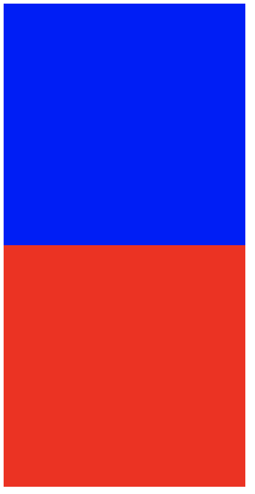

# CSS3


## BFC

BFC(Block Formatting Context) 块格式化上下文，结合 Box 和 Formatting Context 来理解：

- Box 是 CSS 布局的最小单位
- Formatting Context 是页面中的一块渲染区域，有自己的渲染规则，它决定其子元素如何定位以及和其他元素的关系和相互作用

BFC 有点类似对象的封装特性，具有 BFC 特性的元素可以看作是隔离的独立容器，容器内的元素不会在布局上影响到外面的元素

形成 BFC 的触发条件：

- body 根元素
- 浮动元素：float 除了 none 之外的值
- 绝对定位：position: absolute || fixed
- display 为 inline-block、table-cells、flex
- overflow 除了 visible 之外的元素，通常使用 `overflow: hidden` 来实现 BFC


## 布局方式

布局方式一般有：标准流（行内元素，块级元素），浮动，定位（position，z-index），flex布局，display:inline-block

默认为标准流布局方式

### display

#### 通过 display: inline-block 进行布局

首先，了解`display: inline-block`的作用，`display: inline-block` 可以理解为行内块级元素，有行内元素的特性，同时可以设置宽高

利用它进行布局，实现一个三列布局

- 注意，元素设置 `display: inline-block;` 之后，会出现空白空隙，HTML代码中的回车换行被转成一个空白符，在字体不为0的情况下，空白符占据一定宽度，这些元素之间的间距会随着字体的大小而变化，当行内元素font-size:16px时，间距为8px
- 消除的办法是在其父元素上设置 `font-size: 0`;

```html
<style>
	.posi {
		width: 500px;
		height: 300px;
		font-size: 0;
	}
	.posi .child-1 {
		display: inline-block;
		width: 100px;
		height: inherit;
		background: red;
	}
	.posi .child-2 {
		display: inline-block;
		height: inherit;
		background: blue;
		width: calc(100% - 200px);
	}
	.posi .child-3 {
		/*float: left;*/
		display: inline-block;
		width: 100px;
		height: inherit;
		background: black;
	}

</style>
<body>
	<div class="posi">
		<div class="child-1"></div>
		<div class="child-2"></div>
		<div class="child-3"></div>
	</div>
</body>
```

### display: table

利用 `display:table` 和 `display: table-cell` 来进行分列布局和垂直居中

- 如果子节点宽度总和超过父节点，则会像 float 一样表现
- 对于子节点可以结合 `vertical-align: middle` 来实现垂直居中

```html
<style>
	.posi {
		width: 500px;
		height: 300px;
		display: table;
	}
	.posi .child-1 {
		display: table-cell;
		width: 100px;
		height: inherit;
		background: red;
	}
	.posi .child-2 {
		display: table-cell;
		height: inherit;
		background: blue;
		width: calc(100% - 200px);
	}
	.posi .child-3 {
		display: table-cell;
		width: 100px;
		height: inherit;
		background: black;
	}
</style>
<body>
	<div class="posi">
		<div class="child-1"></div>
		<div class="child-2"></div>
		<div class="child-3"></div>
	</div>
</body>
```

### 通过 position 进行定位布局

如果之前父元素由子元素撑开，当给子元素设置 `position:absolute` 之后，由于子元素脱离文档流，父元素高度会变成0

如果仅仅设置元素 `position:absolute`，而不设置其 left 等定位属性，则会保持在原位置

如果设置了left等属性值，此时 body 设置高度很大，**元素还是会基于当前窗口进行定位**，因为此时 body position 还是 static，所以元素会基于窗口进行定位

如果一个元素的z-index大于另一个元素，则该元素的子元素也会覆盖另一个元素，无论其子元素z-index为多少


```css
div {
  /**
   * static：默认值，表示正常的文档流，即标准流
   * relative：相对定位，元素先放置在未添加定位时的位置，再在不改变页面布局的前提下调整元素位置，仍会占位
   * absolute：绝对定位，脱离文档流，相对于最近的非 static 定位祖先元素来进行定位
   * fixed：脱离文档流，相对 window 窗口进行定位，不会受制于父元素
   * sticky 
   */
  position: static;

  /**
   * 用来设置元素叠加顺序，但是依赖定位属性，理解时可以先判断原本覆盖关系，再添加z-index进行考虑
   * z-index 属性值大的覆盖小的，且可以从父元素那里继承
   * z-index 属性值为 auto 不参与层级比较
   * z-index 如果为负值，则会被普通流中的元素覆盖
   */
  z-index: 1;
}
```

一个帮助更加深刻理解的案例

```html
<!DOCTYPE html>
<html lang="en">
<body>
  <div class="posi">
    <div class="child"></div>
  </div>
  <div class="test"></div>
</body>
</html>
```

第一种情况，.child 为相对定位，test 为绝对定位，相当于.child 撑开了 .posi，然后.test元素仅仅设置了 `position:absolute`，所以还是相对标准流进行定位，但是实际上已经脱离了标准流，此时它不再进行占位

```css
.posi .child {
  width: 200px;
  height: 200px;
  background: blue;
  position: relative;
}
.test {
  width: 400px;
  height: 400px;
  background: red;
  position: absolute;
}
```



第二种情况，.child 为绝对定位，.test 为相对定位，此时 .child 已经脱离了文档流，所以不能够撑开.posi元素，导致.test会覆盖在其上面

```css
.posi .child {
  width: 200px;
  height: 200px;
  background: blue;
  position: absolute;
}
.test {
  width: 400px;
  height: 400px;
  background: red;
  position: relative;
}
```


### float

设置元素float（除none）外，会形成 BFC，任何元素都可以设置浮动，浮动会脱离文档流（直观理解就是不会撑开父元素），float设计的初衷是形成文字环绕块元素的效果

消除浮动的办法主要是通过 `clear` 属性来实现

- 添加一个新元素设置 `clear:both`
- 利用 :after 选择器在浮动元素的父元素上添加清除属性
- 为受到影响的元素添加 `clear:both`
- 将父元素设置成BFC，比如设置其 `overflow: hidden;`

```html
<!-- 包含三种解决办法 -->
<style>
	.posi {
		width: 500px;
		height: 300px;
	}
	.posi .child-1 {
		float: left;
		display: inline-block;
		width: 100px;
		height: inherit;
		background: red;
	}
	.posi .child-2 {
		float: left;
		display: inline-block;
		height: inherit;
		background: blue;
		width: calc(100% - 200px);
	}
	.posi .child-3 {
		float: left;
		display: inline-block;
		width: 100px;
		height: inherit;
		background: black;
	}
	.posi:after {
		content: '';
		display: block;
		clear: both;
	}
/*	.posi .child-4 {
		clear: both;
	}*/
	.second {
		height: 200px;
		width: 500px;
		background: green;
		clear: both;
	}

</style>
<body>
	<div class="posi">
		<div class="child-1"></div>
		<div class="child-2"></div>
		<div class="child-3"></div>
		<!-- <div class="child-4"></div> -->
	</div>
	<div class="second"></div>
</body>
```


### flex布局

布局的传统解决方案，基于盒子模型，依赖 `display && position && float`，但是其不适用于特殊布局。因此，W3C 提出了 Flex 布局，其可以简便，完整，响应式地实现各种页面布局且得到各个浏览器的支持

可以为任何一个容器指定 Flex 布局，设为 Flex 布局之后，子元素的 `float,clear,vertical-align` 属性将失效

#### 父容器常用属性

```css
.flex-box {
  display: flex;
  /**
   * flex-direction 用来约定 items 的排列方式
   * row 水平方向，起点在左端
   * row-reverse 水平方向，起点在右端
   * column 垂直方向，起点在上沿
   * column-reverse 垂直方向，起点在下沿
   */
  flex-direction: row;
  
  /**
   * flex-wrap 定义当一条轴线上排列不下时，如何换行
   * nowrap 默认，不换行
   * wrap 换行，第一行在上方
   * wrap-reverse 换行，第一行在下方，即后面的换行元素在之前元素的上方
   */
  flex-wrap: nowrap;
  
  /**
   * justify-content 定义了项目在主轴上的对齐方式
   * flex-start 主轴起始位置至结束位置
   * flex-end 主轴结束位置至起始位置
   * center 居中
   * space-between 两端对齐，项目之间等距分隔
   * space-around 项目两侧间隔相等
   */
  justify-content: flex-start;

  /**
   * align-items 定义在交叉轴上的对齐方式
   * stretch（默认值）：如果项目未设置高度或设为auto，将占满整个容器的高度
   * center：交叉轴的中点对齐，即垂直居中
   * flex-start：交叉轴的起点对齐
   * flex-end：交叉轴的终点对齐
   */
  align-items: stretch;
}
```

#### 子容器常用属性

```css
.flex-item {
  /**
   * order 属性定义项目的排列顺序
   * 数值越小，排列越靠前，默认为 0
   */
  order: 1;

  /**
   * flex-grow 属性定义项目的放大比例
   * 默认为0，0 表示即使存在剩余空间，也不放大
   */
  flex-grow: 1;
}
```


## 盒子模型

类似 swfit 的 UIView，每一个 html 元素都可以看成是一个方块，即“盒子”，根据 width/height 的界定，盒子模型分为**W3C标准盒子模型**和**IE怪异盒子模型**

- W3C标准盒子模型：content.height = height
- IE怪异盒子模型：content.height = height + padding + border.width

`box-sizing` 用来切换块的盒子模型类型

- `box-sizing: border-box;` 代表IE怪异盒子模型
- `box-sizing: content-box;` 代表W3C标准盒子模型