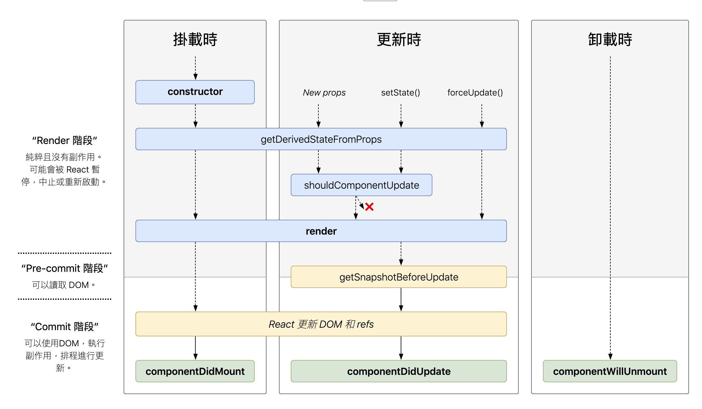

# React

> React 基础知识和概念

## JSX

JavaScript 的语法扩展，执行更快，编译过程就能过滤出一些错误

在 react 中，所有的元素都是 object，区别于浏览器的 DOM 元素

React DOM 用来识别 JSX，将其转换为 object，然后渲染出来，并确保两者保持一致

React Dom 使用**驼峰命名法（camelcase）**来定义属性或者内联样式，这点区别于 HTML

值得一提，React DOM 在渲染之前都会过滤传入的值，将其转换成字符串来有效防范注入攻击

```jsx
// 特例字典，只要原因是处理 javascript 内的保留字
let dict = {
	class: 'className',
	tabindex: 'tabIndex',
	for: 'htmlFor',
	// 事件绑定
	onclick: 'onClick',
}

function Jsx() {
	return (
		{/** htmlFor - for **/}
		{/** tabIndex - tabindex **/}
		<div className='jsx' tabIndex={tabIndex} htmlFor={htmlFor} onClick={onClick}>

		{/** 条件判断 **/}
		{arr.length &&
			<div>...</div>
		}

		{/** 三元表达式 **/}
		{arr.length > 0 ?
			<div>True</div> : <div>False</div>
		}

		{/** 循环 **/}
		{list.map(item => {
			return (<div key={item.key}>item</div>)
			})
		}
		</div>
	);
}
```

### State

不可以在 react `render()` 方法内使用 `this.setState()`，因为无论何时调用 `setState()` 方法后都会调用 `render()`，如果在 `render()` 内调用 `setState()` 方法，会陷入一个死循环

react 将组件视为 **状态机（state machines）**，state 的改变会触发组件的重新渲染

不能通过直接赋值 `this.state.data` 来改变 state 值，而是统一通过 `setState()` 来改变

React 会将多个 `setState()` 调用合并成一个，因此**State 的更新可能是异步的**，如果需要依赖 props 来更新 state，可以通过传入函数回调的办法来解决

```js
// state 为上一个 state
// props 为当前的 props
this.setState((state, props) => ({
  counter: state.counter + props.increment
}));
```

整个原生 state 实例的一个实现思路：

1. 自定义组件被渲染时， react 会首先去调用组件的构造函数，因此 **构造函数内是唯一可以初始化 state 的地方**
2. 之后，react 调用组件的 `render()` 方法，来获取应该展示元素，react 更新 dom 以匹配组件的渲染输出
3. 当组件的输出插入到 dom 中时，调用生命周期钩子 `componentDidMount()` 以及 `setState()` 方法来更新 state
4. 一旦渲染组件从 dom 中移除，react 会调用生命周期钩子 `componentWillUnmount()` 


## 组件

::: tip
组件允许你将 UI 拆分为独立可复用的代码片段，并对每个片段进行独立构思
:::

组件声明：

- 组件本质上是一个函数对象，所以可以通过函数式来声明或者通过ES6的 class 来创建
- 使用类来创建就允许我们使用React其它特性，例如局部状态state、生命周期钩子
- 组件名称必须以大写字母开头
- 组件返回值只能有一个根元素，因此组件在创建时一般用一个 `<div>` 标签来包裹
- 注意所有的React组件必须像纯函数（即输入对应输出）那样使用它们的props，这意味着 props 获取的属性值是只读的

```javascript
// 一个 react 的组件模版
import React from "react";

class Test extends React.Component {
	// 添加状态
	constructor(props) {
		super(props);
		this.state = {
			// javascript object
		}
		this.handleClick = this.handleClick.bind(this)
	}

	// 纯函数，返回渲染内容
	render() {
		// some deals
		return (
			<div>
			// dom element
			</div>
		)
	}

	// 组件被插入到 dom 结构中
	componentDidMount() {
		// statement
	}

	/**
	 * 组件发生更新之后，重新渲染完成
	 * 首次渲染不会执行
	 * 需要在条件语句内调用 setState 方法，避免死循环
	 */
	componentDidUpdate(prevProps) {
		if (this.props.user !== prevProps.user) {
			// this.setState(...)
		}
	}

	// 组件从 dom 结构中移除，此时不能够调用 setState()，因为该组件永远不会重新渲染
	componentWillUnmount() {
		// statement
	}

	// 自定义事件
	event = (data) => {
		//statement
	}

	// 一个使用场景就是，当我们接受到新的props时，想去修改原 state 时
	static getDerivedStateFromProps(nextProps, prevState) {
    	if (nextProps.currentRow !== prevState.lastRow) {
	        return {
	            isScrollingDown:
	            nextProps.currentRow > prevState.lastRow,
	            lastRow: nextProps.currentRow
	        }
	    }
	    return null
	}
}

export default Test
```

### class 组件转换为 function

对于纯函数组件，即输入决定输出，输出映射输入的函数，能够进行响应的转换，对比 class 声明组件方式：

- 不需要声明周期函数，直接 `return` jsx template
- 自定义函数声明方式改变

```javascript
function Test(props) {
	const event = (data) => {
		//statement
	};

	return(
		<div className={props.className}>
		// dom element
		</div>
	);
}
```

### constructor

组件内的构造函数，有几点需要特别注意：

- 用来初始化组件，在其内部进行 state 初始化，来避免调用 setState() 而触发的额外渲染
- constructor 内必须调用 `super(props)`，否则无法使用 `this` 对象，它用来调用基类的构造方法，同时将父组件的 props 注入到子组件内
- 如果不初始化 state 或者不进行方法绑定，则不需要为组件实现其构造函数

### 组件的生命周期

React 的生命周期经过了一次迭代，这里记录 React V16 之后的版本



React 生命周期的不同阶段，可以从横向和纵向来分别进行理解，下面重点对**横向比较**进行理解：

1. 挂载阶段，可以理解成组件初始化阶段，即将组件插入到DOM中，只会发生一次
2. 更新阶段，当组件的props改变了，或组件内部调用了setState或者forceUpdate发生，会多次发生
3. 卸载阶段，组件被卸载或者销毁时调用，可以去清除一些定时器，取消网络请求，清理无效的DOM元素等垃圾清理工作，此时调用 setState() 不会生效

在**挂载阶段**，其生命周期函数调用：

- constructor
- static getDerivedStateFromProps
- render，纯函数，返回渲染内容
- componentDidMount，存放业务逻辑，组件装载之后调用，此时可以获取到DOM节点并操作

在**更新阶段**，其生命周期函数调用：

- static getDerivedStateFromProps
- shouldComponentUpdate，返回布尔值来表示是否需要更新组件，当调用 forceUpdate 并不会触发此方法
- render
- getSnapshotBeforeUpdate
- componentDidUpdate

在**卸载阶段**，其生命周期函数调用：

- componentWillUnmount

**getDerivedStateFromProps(nextProps, prevState)** 是一个静态方法，所以不能使用 this，其有两个参数，返回一个对象来更新当前的 state，如果不需要更新则返回 null

- `nextProps` 指接收到的新参数
- `prevState` 指当前的 state 对象
- 根据图示可以看出，其在 constructor, New props, setState(), forceUpdate() 之后调用
- 一个使用场景就是，当我们接受到新的props时，想去修改原 state 时

### 组件通信

- 父组件使用子组件方法，将子组件 this 作为参数传递给父组件，父组件通过 `this.child` 来挂载
- 子组件使用父组件方法，直接将父组件定义好的方法传递给子组件，子组件通过 `this.props` 来访问方法
- 兄弟组件之间通信，将数据挂载至其最近父组件上来进行访问

除此之外，还可以利用第三方库，比如 redux 来对系统内通信进行统一管理

```javascript
// 子组件
class Child extends Component {
	componentDidMount() {
	   this.props.onRef(this);
  	}
  	...
}

// 父组件
class Parent extends Component {
	onRef = (ref) => {
	   this.child = ref;
	}

	// 调用
	submit = () => {
	    // this.child...
	 }

	render() {
		return (
			<Child onRef={ this.onRef }>
		)
	}
}
```


## 错误处理

### Error boundaries

Error boundaries 是 React 组件，它会在其子组件树中的任何位置捕获javascript错误，并记录这些错误，展示降级UI而不是崩溃的组件树

它仅捕获其子组件中的错误，本身的错误无法捕获

如果 class 组件定义了 `static getDerivedStateFromError()` 或 `componentDidCatch()` 生命周期方法，则该组件就成为了 Error boundaries

```jsx
class App extends React.Component {
    constructor(props) {
        super(props);
        this.state = {
            hasError: false
        };
    }

    render() {
        if (this.state.hasError) {
            return (
                <h1>Somethings went wrong.</h1>
            );
        };
        return (
            <BrowserRouter>
	            <div className={`homeBox ${systemConfig.hugeScreen ? 'max' : 'mac'}`}>
					<!-- statement -->
	            </div>
            </BrowserRouter>
        )
    }

    static getDerivedStateFromError(error) {
        return { hasError: true };
    }

    componentDidCatch(error, info) {
        console.error(error, info);
    }
}
```

**static getDerivedStateFromError()**

`static getDerivedStateFromError()` 是一个静态方法，通常用来更改 state，该生命周期会在后代组件抛出错误后被调用

它将抛出的错误作为参数，并返回一个值以更新 state

`static getDerivedStateFromError()` 会在渲染阶段调用，因此不允许出现副作用

**componentDidCatch()**

在后代组件抛出错误后调用，通常用来执行一些副作用，比如将日志写入数据库内等，它接受两个参数：

- error 抛出的错误
- info 带有 componentStack key 的对象，其中包含有关组件引发错误的栈信息

`componentDidCatch()` 会在 commit 阶段被调用


## 事件绑定

直接绑定到 JSX 元素上，类似 dom 元素事件绑定，传入一个函数方法而不是一个字符串

camelcase，即（`onClick` 而不是 `onclick`）

不能通过 `return false;` 来阻止元素的默认行为（比如 `<a>` 标签），而是通过 `e.preventDefault()` 来实现

### bind this

通常情况下，如果你没有在方法后面添加 `()`，则需要为该方法绑定 `this`

在 ES6 中，class 是不会默认绑定 `this` 的，有三种方法为其绑定：

通过 ES6 的箭头函数

```javascript
class EventHandle extends React.Component {
  handleClick() {
    console.log('this is:', this);
  }

  render() {
    return (
		// data 为传参，可不传
      <button onClick={(e) => this.handleClick(data, e)}>
        Click me
      </button>
    );
  }
}
```

2. 通过 `bind()` 方法，利用 `function.prototype.bind` 方法

- 在 constructor 内通过 bind 绑定 this
- 元素内直接绑定 this

```javascript
class EventHandle extends React.Component {
  constructor(props) {
    super(props);
    // 在 constructor 内通过 bind 绑定 this
    this.handleClick = this.handleClick.bind(this);
  }

  handleClick() {
    onsole.log('this is:', this);
  }

  render() {
    return (
    	// 或者直接绑定 
    	// <button onClick={this.handleClick.bind(this, data)}>
    	// data 为传参，可选
      <button onClick={this.handleClick}>
        Click me
      </button>
    );
  }
}
```

通过实验方法来绑定，`creat-react-app` 内默认使用

```javascript
class EventHandle extends React.Component {
  // 这个语法保证 this 绑定到 handleClick 方法上
  // Warning: 试验性方法
  handleClick = () => {
    console.log('this is:', this);
  }

  render() {
    return (
      <button onClick={this.handleClick}>
        Click me
      </button>
    );
  }
}
```