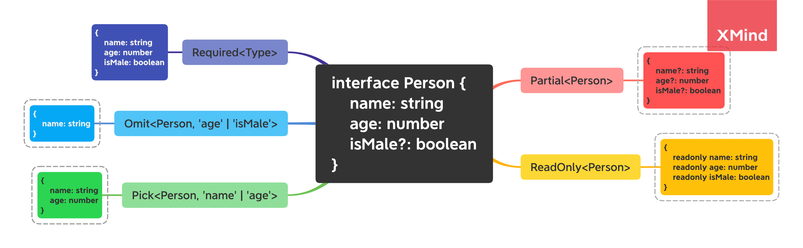
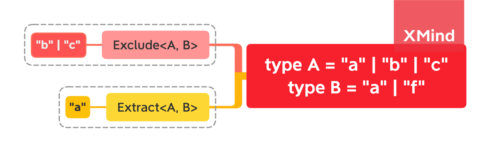
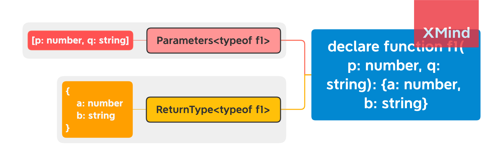

# **Utility Types**

::: tip
TypeScript provides several utility types to facilitate common type transformation
:::

## Common Utility 

- `Partial<Type>` && `Required<Type>` 
- `ReadOnly<Type>`
- `Pick<Type>` && `Omit<Type>`

这里我将以上 Utility Types 放在一起，是因为它们有相似的行为，即传入一个**类型定义**，返回一个**新的类型定义**，新的定义类型会基于原类型的属性进行更改



1. `Partial<Type>`，英译为**部分的**，用来将 `Type` 内所有的属性转换为可选类型，并返回一个新的类型，更通俗的解释就是：返回给定 `Type` 的所有子集
2. `Required<Type>` 行为与 `Partial<Type>` 恰恰相反，它会将 `Type` 内所有属性转换为必须类型，同时返回一个新的类型，即“我全都要”
3. `Readonly<Type>` 行为与 `Partial<Type>` 行为类似，它会将所有 `Type` 内的属性转换为**只读的**，并返回一个新的类型
4. `Pick<Type, keys>` 通过传递一个键的集合，从指定类型中取出指定的属性，返回一个新的类型定义，这里需要注意的是，**通过 `union` 来指定需要选择的属性**
5. `Omit<Type, keys>` 行为与 `Pick<Type, keys>` 相反，可以类比 `lodash.omit` 进行理解

这里展示 `Pick<Type, keys>` 的简单的示例，`Omit<Type, keys>` 可以类推

```typescript
// Pick
interface Person {
    name: string
    age: number
    isMale?: boolean
}

let a: Pick<Person, 'name' | 'age'> = {
    name: 'lucky',
    age: 27,
    isMale: true // error: Object literal may only specify known properties, and 'isMale' does not exist in type 'Pick<Person, "name" | "age">'.(2322)
}
```


## Union Related

- `Exclude<Type, Union>` 相当于对两个集合求**差集**
- `Extract<Type, union>` 相当于对两个集合求**交集**

这里将包含 `union` 参数的 utility 归位一类，它们的行为类似对集合进行处理，在处理 `union` 类型时能够提供便利



参考下面这个例子进行理解：

```typescript
// Exclude<unionA, unionB>
type A = "a" | "b" | "c"
type B = "a" | "f"

// type C = "b" | "c"
type C = Exclude<A, B>

// error: Type '"a"' is not assignable to type '"b" | "c"'.(2322)
let v1: C = "a"

// Extract<unionA, unionB>
// type E = "a"
type E = Extract<A, B>

// Type '"b"' is not assignable to type '"a"'.(2322)
let v2: E = "b"
```


## Function Related

- `Parameters<Type>`
- `ReturnType<Type>`

这里将函数类型的操作归为一类,主要针对函数的传参/返回值进行处理,返回相应的数据类型



1. `Parameters<Type>` 获取函数所有的传参, 并返回一个元组(tuple)
2. `ReturnType<Type>` 获取函数的返回值类型, 返回

参考下面的例子来进行理解:

 ```typescript
declare function f1(p: number, q: string): {a: number, b: string}

// 这里注意使用 typeof 来获取其类型
// 生成一个元组类型: [p: number, q: string]
type ParamsType = Parameters<typeof f1>

// success
const p1: ParamsType = [1, 'a']

// Type 'number' is not assignable to type 'string'.(2322)
const p2: ParamsType = [1, 2]


// ReturnType: 捕获返回值类型
type ReturnParams = ReturnType<typeof f1>

// success
const r1: ReturnParams = {
    a: 1,
    b: 'hello'
}

// The expected type comes from property 'b' which is declared here on type '{ a: number; b: string; }'
const r2: ReturnParams = {
    a: 1,
    b: 2
}
 ```


## Interesting Utility

还有一些 Uitlity 拥有一些“有趣”的行为,这里将它们归为一类:

- `Record<Keys, Type>`
- `NonNullable<Type>`: 就是保证类型内不存在 `null` 和 `undefined`

`Record<Keys, Type>` 用于将每个 Key 内对应到指定 Type, 参考下面的例子来进行理解:

```typescript
interface Person {
  name: string
}

type Names = "Kitty" | "Nik"

const nav: Record<Names, Person> = {
  Kitty: { name: 'kitty'},
  Nik: {name: 'nik' }
}
```


**Thanks for you reading, solo with code!**

