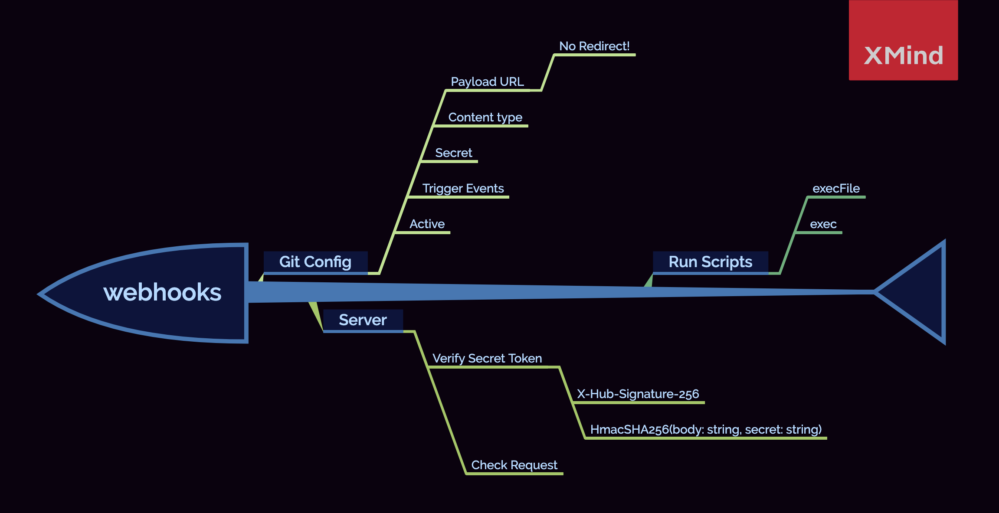
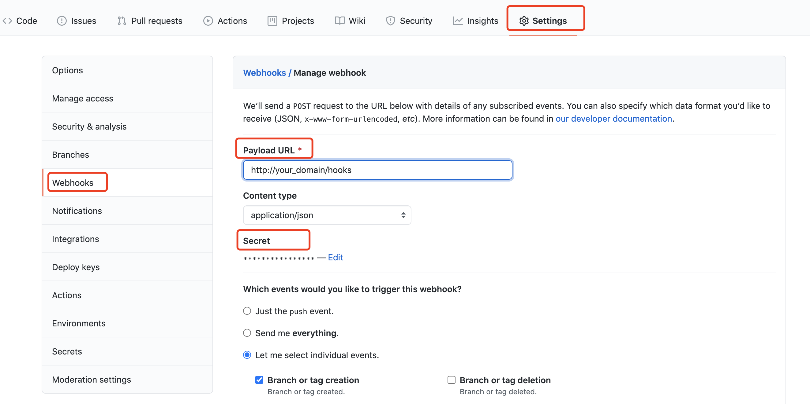
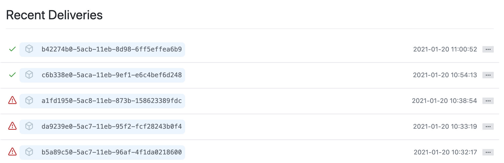

# Webhooks TEST

> Webhooks allow you to build or set up integrations

在日常开发过程中，你一定会有这样的困扰：有一些流程化的工作，甚至是一些很小的改动，都会经历：开发 - 测试 - 提交 - 打包 - 上传 - 编译 - 发布等过程，频繁的重复，大大地降低了我们开发的乐趣！

为此，Git 通过提供 webhooks 来使我们具备可集成的能力。通俗来说，就是 Github 针对你的一系列活动，提供了一些“钩子”，当你进行某项活动时（比如：新建一个 tag），Github 会主动向你的服务器发送一个请求，通知你指定事件正在被触发，通过对请求进行捕获和分析，你可以通过脚本等方式在服务器上执行后续步骤。

**关键点：**

- 配置 `web hooks.Payload URL` 时，注意 Github 目前不支持转发服务(Redirect)，如果你在服务器通过 nginx 配置了转发，且配置 Payload URL 为转发域名，则 Github 会返回 **502**，解决方案：暴露 `host:port/path` 
- 注意 Github 对 secret 的加密方式和对比验证




## Config webhooks

首先，我们需要在 Github 上进行设置：服务器地址，参数类型，secret，触发事件以及是否激活



1. 设置 Git 需要监听哪些事件来触发 webhooks
2. 在服务器内添加路由，用来接受和处理 webhooks 负载（请求）

**注意：webhooks Payload URL 暂不支持域名转发，可以通过 host:port 来代替**


### Secret

类似 `token`, 用来告诉服务器当前请求来自于 Github

当设置 `secret` 之后，POST 请求会带上 `X-Hub-Signature` 和 `X-Hub-Signature-256` 的请求头

推荐使用 `X-Hub-Signature-256` 以提高安全性


## Run a server

在服务器上，需要暴露给 GitHub 一个 POST 接口，它主要干三件事：

1. 接受 Github 的请求，获取请求数据
2. 验证 secret 和仓库信息
3. 执行脚本

> Talk is cheap, show me the code!

```typescript
// 关键代码
// common.ts, see https://docs.github.com/cn/developers/webhooks-and-events/securing-your-webhooks for details
export function verifyToken(bodyString: string, secret: string, signature: string) {
  // 编码 secret
  const verifyToken = HmacSHA256(bodyString, secret).toString()
  return signature === `sha256=${verifyToken}`
}

// hooks.control.ts
@Controller('/hooks')
export class HooksController {
  constructor(private hooksService: HooksService) {}
  @Post()
  async reciveHooks(@Body() data: any, @Headers() h: any ) {
    const signature = h['x-hub-signature-256'] || h['X-Hub-Signature-256']
    // 验证通过
    if (verifyToken(JSON.stringify(data), hooksSecret, signature)) {
      const { repository } = data
      // 如果是指定仓库则执行响应的打包命令
      if (repository && repository.name === 'cms-apis') {
        try {
          // 执行后续步骤
          this.hooksService.build('release')
          return this.hooksService.successed()
        } catch (error) {
          Logger.error(error)
          return this.hooksService.failed()
        }
      }
    }
    return this.hooksService.failed('Verify Failed!')
  }
}
```


## Test webhooks

一切准备就绪之后，我们还需要验证自己搭建的流程是否可行，可以直接在 Github 上进行查看，我们可以查看 Github 发起请求的具体信息（Headers 和 body）以及服务器返回结果




**🔥Solo with code!🔥**

