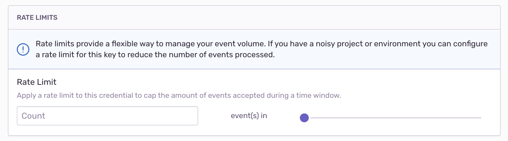

# Sentry

> Sentry is a service that helps you monitor and fix crashes in realtime!

## 名词

- event volume：事件体量
- PII（Personally Identifiable Information）：个人身份验证信息

## 为什么需要 Sentry?

Sentry 能够提供在生产环境内的实时错误追踪，并且包含针对错误一系列的处理流程。

- 及时发现、响应线上问题
- 通过合理的信息展示，验证问题修复情况
- 针对问题进行多维分析

## Architecture

这里对 Sentry 的[架构](https://develop.sentry.dev/architecture/) 进行理解


## Sentry Web Server

参考 [sentry develop](https://develop.sentry.dev/environment/) 了解怎么进行本地部署，这里对实施关键步骤进行记录

- 从 [sentry](https://github.com/getsentry/sentry) 内 clone 项目到本地，之后 `xcode-select --install` 或者启动 Xcode 更新 Xcode CLI tools
- 进入 sentry 本地目录，执行 `brew bundle --verbose` 安装在 Brewfile 内列出的各种软件
- Sentry 依赖 [python wheels](https://pythonwheels.com/)，它包含一些二进制包，因此保证 Mac 版本比较新，然后有安装 rust 环境
- Sentry 利用 [pyenv](https://github.com/pyenv/pyenv) 来安装和管理 python 版本，执行 `brew install pyenv` 安装一下，之后执行 `make setup-pyenv` 安装 Sentry 依赖环境
  - 安装完成之后，执行 `which python` --> 预期出现 `/usr/bin/python`
  - 修改 `bash_profile`，添加 `#pyenv \n eval "$(pyenv init -)" \n export PATH="$HOME/.pyenv/bin:$PATH"` 来指定路径
  - 执行 `eval "$SHELL"` 重启控制台，<b>重启控制台特别关键</b>
  - 再次执行 `which python` --> 预期出现 `/Users/you/.pyenv/shims/python`，相当于做了一次拦截，将 python 命令托管给 pyenv 后统一处理
  - 在 sentry 根目录下，执行 `python -m venv .venv` 创建虚拟运行环境
  - `source .venv/bin/activate` 启用运行环境
  - 此时在虚拟环境内执行 `which python` --> 预期出现 `/Users/you/sentry/.venv/bin/python`
- Sentry 依赖 [volta](https://github.com/volta-cli/volta) 来安装和管理 Node.js 版本
  - 执行 `curl https://get.volta.sh | bash` 来 install volta
  - 执行 `eval "$SHELL"` 来重启控制台，<b>真的很重要</b>
  - 修改 `bash_profile`，添加 `export VOLTA_HOME="$HOME/.volta" \n export PATH="$VOLTA_HOME/bin:$PATH"`
- 执行 `make bootstrap` 来安装 sentry 依赖，启动一些依赖服务，可以直接在 Docker Dashboard 内观察
- Sentry 依赖 [direnv](https://github.com/direnv/direnv) 来自动激活你的虚拟环境，设置一些必要的环境变量，并且会自动检测你的环境是否可用
  - 执行 `brew install direnv` ，之后在 `.zshrc` 文件末尾添加配置 `eval "$(direnv hook zsh)"`  
  - 执行 `eval "$SHELL"` 重启控制台
- 理论是，此时你可以在控制台内执行 `sentry` 命令，通过 `sentry devserver` 来启动服务，通过 `127.0.0.1:8000` 进行访问


## Relay Server

> The Sentry Relay is a service that pushes some functionality from the Sentry SDKs as well as the Sentry server into a proxy process.

参考 [relay](https://github.com/getsentry/relay) ，了解如何进行本地开发/部署

1. 依赖 rust 环境，[安装 rust](https://learnku.com/rust/wikis/29018)
2. `brew install cmake`，安装 cmake，CMak e是一个比 make 更高级的跨平台的安装、编译、配置工具
3. `brew install java`，安装 java 执行环境
4. `brew install kafka` 和 `brew install zookeeper` 部署 kafka 服务
5. `brew install redis` 部署 redis 服务

#### Init

观察 `Makefile`，这里梳理本地 run 的流程：

1. `relay-generate` 内依赖 [uap-core](https://github.com/ua-parser/uap-core)，以 submodule 的形式进行引入，因此需要执行 `make setup` 来初始化依赖，注意，如果碰到 `pip command not found` 的问题，查看本地的 pip 映射目录，我通过将 Makefile 内的 pip 替换成 pip3 解决
2. 执行 `make test` 检查 rust, python 以及 integration 的编译和测试用例情况
3. 执行 `cargo run --all-features -- config init` 初始化 Relay 服务
4. 执行 `cargo run --all-features -- run`

通过 `relay config init` 创建一个初始配置，之后将配置文件放在 `.relay` 内

**Config**

通过修改 `.relay/config.yml` 文件可以覆盖默认配置

```yaml
relay:
  mode: managed
  upstream: "https://sentry.io/"
  host: 127.0.0.1
  port: 3000
  tls_port: ~
  tls_identity_path: ~
  tls_identity_password: ~
```

**Credentials**

在 `.relay/credentials.json` 内读取公钥和私钥，用来验证上游服务器

通过也可以将 public key 用来在 sentry web 上注册 relay，用来覆盖默认配置，relay 服务会读取其配置的修改，比如：PII stripping, filtering, rate limiting 等等


## Data flow

### APP with SDK

在客户端内，sentry 提供了一些配置来[清洗数据](https://docs.sentry.io/platforms/javascript/configuration/filtering/#using-beforesend)

- `beforeSend(event): event | null` 通过对 events 的信息进行判断，返回 null 则表示不进行上报
- `tracesSampler(samplingContext): number`  通过返回采样率来进行处理，如果返回 0 则表示不进行上报
- 配置 `ignoreErrors` 和 `denyUrls` 来进行显式过滤

### Rate limit

在 Sentry Project 内设置  `setting > Client Keys(DSN) > RATA LIMITS` 来<b>限制指定时间段内接受事件的数量</b>，用来处理项目相当“嘈杂”时（上报数据质量低，但是上报量巨大）的情况



### Filter

在 Sentry Project 内设置 `setting > Inbound Filters` 来<b>阻止 sentry 在存储特定场景下的事件</b>，[参考](https://docs.sentry.io/product/data-management-settings/filtering/)

### Data Scrub

在引入第三方服务时，我们需要搞清楚哪些数据能够允许被发送到 sentry, 哪些允许被存储。除了如上提到的通过 SDK 的方式来筛选和清理敏感数据外，Sentry 也提供配置来在服务端进行[数据清洗](https://docs.sentry.io/product/data-management-settings/server-side-scrubbing/)

通过一个新的配置项 `setting > Security & Privacy` 来配置数据清洗的[高级操作](https://docs.sentry.io/product/data-management-settings/advanced-datascrubbing/)


### Aggregation

