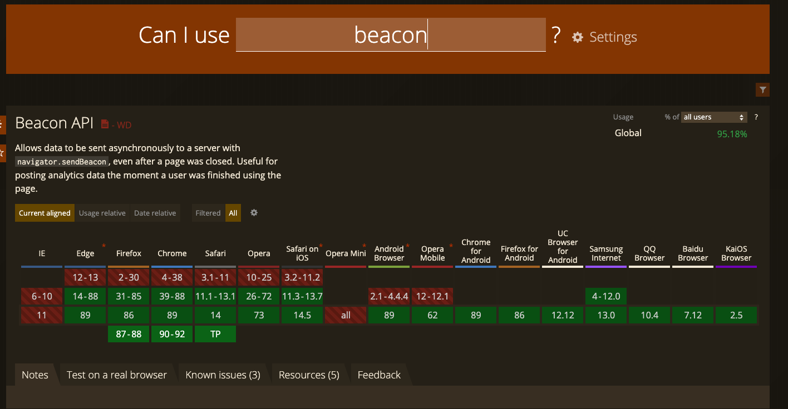

# Navigator


## sendBeacon()

> `navigator.sendBeacon(url: string, data: string | Blob | FormData | ArrayBufferView)` 用于将数据异步传输到指定接口，主要满足统计和诊断代码的需要！

<a href="https://caniuse.com/?search=beacon" target="blank"></a>


通过 [页面生命周期](https://7k7k.life/explores/webs/page-lifecycle.html) 我们了解到，当页面应用捕获到 `unload` 事件或者处于 terminated 状态时，会主动卸载应用释放资源，此时如果你希望上报一些性能行为数据的话，往往是不可靠的，也不建议这么做。因为如果过早发送请求，可能会错误收集时机，过晚发起同步请求，很有可能会被浏览器给丢弃掉！

之前怎么做的呢？

1. 监听到文件卸载，通过脚本创建一个 `image` 标签，通过设置其 `src` 属性来延迟卸载，发送数据；
2. 通过创建一个 no-op 的循环处理，来延迟卸载，从而保证向服务器发送数据；

这样的做法，都是通过一系列手段延迟卸载，从而保证请求的发出。但是，同步的请求会迫使用户延迟卸载文档，进而导致下一个页面加载延迟，这样会极大损害用户体验！

因此，Web API提供 `sendBeacon()` 方法，来将数据放入**异步传输队列**中，同时返回一个 boolean 值来表示该操作是否成功。它会在恰当的时间异步向服务器发送请求，同时不会延迟卸载页面或者影响下一个页面的载入。

通过观察一个多页面应用你就会发现：1）当你在当前窗口，跳转到一个新的页面时，`sendBeacon()` 会在新页面加载完毕时触发；2）当你关闭当前窗口时，`sendBeacon()` 会立即触发；

```javascript
window.addEventListener('unload', () => {
  navigator.sendBeacon('http://127.0.0.1:3000/api/perf', JSON.stringify(window.screen))
}, false);
```


