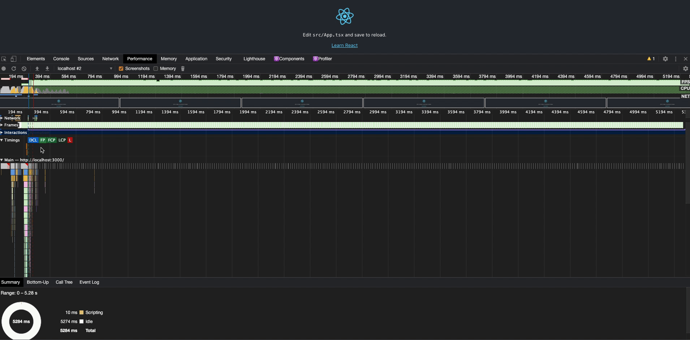
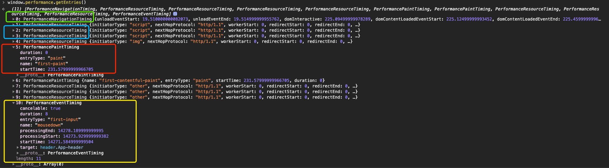
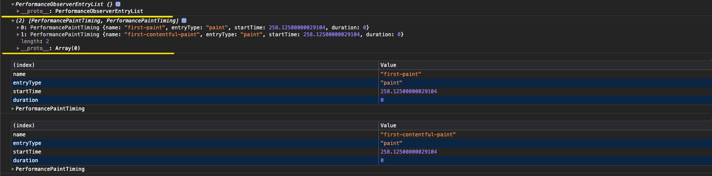

# Performace

::: tip
1. 前端性能监控的基础知识储备
2. 封装一个前端性能监控的组件
3. 针对前端性能分析数据可视化
:::

## Base

就让我们的探索旅程从 Chrome performance 的一个示例开始!



我们可以观察到, 在 `Timings` 维度内, Chrome 观察了五个指标, 那么我们如何通过它提供的 API 来重新造一个轮子呢?

"磨刀不误砍柴工", 我们先来学习相关的 API


### Performace Entries

`PerformanceEntry` 对象表示 performance 时间线上一系列的指标(metric), 指标的来源可以分为两部分:

- 手动构建, 通过 `mark` 或者 `measure` 来生成
- 自动生成, 在资源加载时, 会被动生成(例如图片, script 等资源加载)

执行 `window.performance.getEntries()` 来获取当前应用的所有性能指标数据, 返回值为一个对象数组, 如下所示:



通过观察结果的 `key` 值, 大致分为四种类型:

- **PerformanceNavigationTiming**
- **PerformanceResourceTiming**
- **PerformancePaintTiming**
- **PerformanceEventTiming**

上面类型的公共属性:

- `name` 表示该 performance entry 的名称, 可以是资源名称、URL 或者自定义指标名等
- `entryType` 上报指标的类型, 这个由浏览器本身来进行定义, 参考 [MDN entryType](https://developer.mozilla.org/zh-CN/docs/Web/API/PerformanceEntry/entryType)
- `startTime` 指标开始上报的时间
- `duration` 该事件发生的整体耗时

此外, 各个类型(除 PerformancePaintTiming 外)还有其他更为详细的属性信息


### PerformanceObserver

**性能监测对象** 用来监测性能度量事件(可以理解为**性能事件的 Listener** ), 当浏览器的时间线记录一个新的 `performance entries` 时进行捕获

这里需要注意 `observe()` 方法的传参问题, 具体可以参考[W3C observe](https://w3c.github.io/performance-timeline/#observe-method)

- `entryTypes` 和 `type` 只能选择其一传入, 因为 `observe()` 会根据传参的键来进行不同模式(multiple 或者 single)的处理

```javascript
// 声明一个 PerformanceObserver 示例对象, 并且注册一个回调
const ob = new PerformanceObserver((list) => {
  console.log(list) // 返回一个 `PerformanceObserverEntryList Object`
  console.log(list.getEntries()) // 通过 `getEntries()` 获取 `performance entries`
  for (const entry of list.getEntries()) {
    // `entry` is a PerformanceEntry instance.
    console.table(entry)
  }
})

// 指定监控的 `entryType` 集合, 当指定 `entryType` 的指标被捕获到时, 会触发在声明实例对象时的回调
ob.observe({ entryTypes: ['paint'] })
// 停止接受性能条目
ob.disconect()
```

让我们看看一个简单页面的针对 `paint` 类型指标的捕获内容:




## Metrics

我们已经通过一些手段获取了一堆性能数据, 接下来我们要做的事情就是对这些数据进行分类和分析.

我会沉淀一些通用的性能指标


### FP(First Paint)

`FP = Anything as visually different - Navigator`, 即浏览器开始导航到浏览器屏幕发生可视化改变的时间间隔


### FCP(First Contentful Paint)

浏览器从导航到渲染 DOM 内容的第一个字节(就是一个 DOM 元素的第一个字节)所花费的时间, 通常情况下 FP 等于 FCP


### LCP(Largest Contentfil Paint)

视窗内可见的的渲染时间最大的 `image or text block`, 比如 `<svg>`, `<image>`, `<video>` 等存在 url 属性的元素

这是一个很有意义的指标, 它基本上反映了是页面内渲染主要内容的耗时

一个更快的 LCP 能够帮助用户确认当前页面是[可用的](https://web.dev/user-centric-performance-metrics/#questions)(即是否足够的内容让用户可以进行交互)

👀注意:

- 对于类 `image` 元素, 上报的 `size` 通常是指视窗内可见的尺寸, 如果元素被隐藏或者部分处于视窗外面(被裁剪或者存在不可见的溢出), 则这部分不会被计入元素的大小
- 对于类 `text` 元素, `size` 代表包含文本内容最小矩形的尺寸

并且, 为了保证计算和分配新性能条目的开销较低, 元素大小或位置的更改不会生成新的 LCP 候选对象

**Load time or Render time**

对于跨域的图片资源, 如果没有设置 `Timing-Allow-Origin` 的话, 出于安全的考虑, 只会记录其 LoadTime. 因此, 如果条件允许的话, 通常建议去设置 `Timing-Allow-Origin` 的请求头.

### FID(First Input Delay)

用户在网站上发出第一个交互事件到浏览器真正对交互事件产生反应所花费的时间