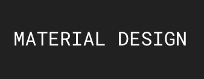

# Css

## Font Style

Roboto Mono 实现效果



```css
font-family: "Roboto Mono",monospace;
```


## position

```css
div {
  /**
   * static：默认值，表示正常的文档流
   * relative：相对定位，元素先放置在未添加定位时的位置，再在不改变页面布局的前提下调整元素位置，仍会占位
   * absolute：绝对定位，脱离文档流，相对于最近的非 static 定位祖先元素来进行定位
   * fixed：脱离文档流，相对 window 窗口进行定位
   * sticky 
   */
  position: static;
}
```


## media

`@media` 可用于根据一个或多个基于设备类型、具体特点和环境的媒体查询来应用样式

`@media` 可以针对不同的屏幕尺寸设置不同的样式，特别是如果你需要设置设计响应式的页面，`@media` 是非常有用的。当你重置浏览器大小的过程中，页面也会根据浏览器的宽度和高度重新渲染页面

注意 `@media` 需要放在 CSS 内容的最下面，否则会被覆盖

`@media` 样式规则： `@media 媒体类型 and (筛选条件){样式}`

```css
// max-width(小于等于)，min-height(大于等于) 高度同理
@media screen and (max-width: 1680px) {
    .V-content .con-cap .cap-time {
      color: #fff;
    }
}
```

`@media screen and (orientation:portrait)`: 表示指定输出设备中的页面可见区域的高度大于或者等于宽度

`@media screen and (orientation:landscape)`： 表示除 portrait 之外的所有情况


## 文字样式相关

`text-overflow` 属性确定如何向用户发出未显示的溢出内容信号，包含三个属性值，这个属性只对那些在块级元素溢出的内容有效，但是必须要与块级元素内联(inline)方向一致

```css
p {
  /**
   * 确定如何向用户展示溢出样式
   * ellipsis: 用 ... 省略号来代替被截断的文本
   * <string>: 通过自定义字段来代替被截断的文本。如果空间太小到连省略号都容纳不下，那么这个字符串也会被截断
   * clip: 默认值，在内容区域的极限初裁剪文本
   */
  text-overflow: clip;
}
```

`text-transform` 属性用来控制文本的大小写

```css
p {
  /**
   * 用来控制文本的大小写
   * capitalize: 每个单词的首字母大写
   * uppercase: 所有字母大写
   * lowercase: 所有字母小写
   * none: 默认值，不做任何转换
   */
  text-transform: none;
}
```

`white-space` 属性用于确定如何处理元素内的空白（Tab，Space，Enter）

```css
p {
  /**
   * 用于确定如何处理元素内的空白（Tab，Space，Enter）
   * pre-line: 所有空格、制表符合并成一个空格，回车不变，文本换行
   * pre-wrap: 所有空白保留且生效，文本换行
   * pre: 所有空白保留且生效，文本不换行
   * nowrap: 所有的空白都合成一个空格，不换行
   * normal: 默认值，所有的空白都合成一个空格，自动换行，这意味着回车等会失效
   */
  white-space: normal;
}
```

`word-warp` 长单词或者url换行属性

```css
p {
  /**
   * 长单词或者url换行属性
   * normal：浏览器默认值，只在允许的断字点换行
   * break-word：在长单词或者url内部进行换行
   */
  word-wrap: normal;
}
```


