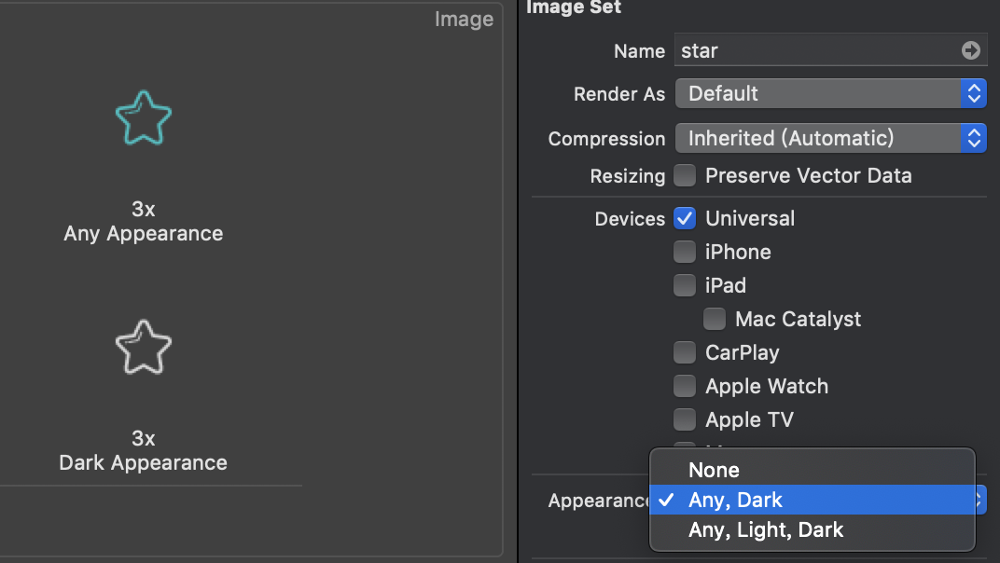

# Swift4.x In Project

> 用来记录在使用Swift4进行实际开发过程中遇到的综合性较强的问题

## System

::: tip
记录**系统**相关问题
:::

### Could not locate device support files

由于手机 ios 升级到13之后，现在版本的Xcode缺少相应的文件，导致无法在真机上进行测试，解决办法：

1. 直接更新 Xcode，时间长，另外通过网盘来安装 Xcode 会出现很多问题，所以一般忽略这种办法；
2. 将相应的 SDK 文件导入，在应用程序内找到Xcode，右键“显示包内容”，根据路径 `Contents-->Developer-->Platforms-->iPhoneOS.platform-->DeviceSupport`，将相应的包复制进去之后重启Xcode
3. 在[开发者官网](https://developer.apple.com/download/) 下载更新的 Xcode beta，一般 Xcode 会和新版iOS一起发布

### 为 App 启动页设置图片展示

1. 在 `app > general` 内，设置 App Icons and Launch Images 选项


2. 在 Assets.xcassets 资源文件内添加相应的启动页图片
3. 点击进入 LaunchScreen.storyboard，点击 `view`
4. 点击右上角 `Library` 图标，输入 `image`，选择 `ImageView`，并拖入视图区域
5. 选择刚刚拖入的 ImageView，点击右上角 `Size` 图标，设置其尺寸，点击右上角 `Attributes` 图标，选择图片
6. 重启app

### DarkMode

适配iOS13新增的dark模式特性，适配主要基于：

- color，系统已经适配了颜色（即不设置颜色时），同时支持自定义动态颜色
- image，支持系统图标的切换，同时支持自定义的动态图标
- 监听模式变化，从而触发自定义事件
- 为模式变化添加 log

**获取当前模式**

在 UIView 或者 UIViewController 内通过 `traitCollection.userInterfaceStyle` 返回当前的模式，其值对应一个枚举

```swift
// userInterfaceStyle 是一个枚举，声明如下
public enum UIUserInterfaceStyle: Int {
	case unspecified
	case light
	case dark
}

/**
 * UIColor
 * 在 iOS13 之前，仅支持一种颜色，但是之后，提供一个回调方法，用来动态设置颜色
 */
var backColor: UIColor!
let label = UILabel()
backColor = UIColor(dynamicProvider: { (trainCollection) -> UIColor in
    if self.traitCollection.userInterfaceStyle == .dark {
        return UIColor.black
    } else {
        return UIColor.white
    }
})
label.textColor = backColor

// 监听模式变化
override func traitCollectionDidChange(_ previousTraitCollection: UITraitCollection?) {
    super.traitCollectionDidChange(previousTraitCollection)
    if traitCollection.hasDifferentColorAppearance(comparedTo: previousTraitCollection) {
        self.setModeLabel()
    }
}
```

**图片适配**



**添加log**

在 `Product > Scheme > Edit Scheme > Run > Arguments Passed On Launch` 设置 `-UITraitCollectionChangeLoggingEnabled YES` 


## EventBind

::: tip
为控件添加自定义事件
:::

### 为UIImageView等无事件视图添加事件绑定

有些视图本身是不能直接通过 `addTarget()` 来添加方法的，要为此类视图添加方法，一个解决思路是为其添加手势控制

```Swift
// isUserInteractionEnabled 确定忽略用户事件并从事件列队中删除
deleteIconView.isUserInteractionEnabled = true

// 定义手势控制
let singleTap: UITapGestureRecognizer = UITapGestureRecognizer(target: self, action: #selector(clearUserTextInput(_:)))
// numberOfTouchesRequired 触发事件需要的手指数
singleTap.numberOfTapsRequired = 1

// 为icon添加点击事件
deleteIconView.addGestureRecognizer(singleTap)
```


## KeyBoard

::: tip
记录**键盘**相关问题
:::

### UITextField 点击空白处隐藏键盘

UITextField 在获取焦点时会自动弹起键盘，此时点击空白处不会让其失去焦点，因此需要手动添加事件来控制当前空间失去焦点

一个思路是，在触摸开始时取消指定控件作为第一响应者（即失焦）

`resignFirstResponder` 通知此对象已要求它在其窗口中放弃作为第一响应者的状态

```Swift
override func touchesBegan(_ touches: Set<UITouch>, with event: UIEvent?) {
	super.touchesBegan(touches, with: event)
    textField.resignFirstResponder()
}
```

特殊情况的处理：如果在输入框内自定义了一些 icon 来行使某些功能，点击时会先触发重写的 `touchesBegan` 方法，如果要避免某些视图的冒泡场景，一个解决思路就是，重写该视图类的 `touchesBegan` 方法来达到阻止冒泡的行为

```Swift
class UIImageViewWithoutTouchToSuper: UIImageView {
    override func touchesBegan(_ touches: Set<UITouch>, with event: UIEvent?) {
        // 什么都不做，则不会触发任何事件
    }
}
```

### 全局监听键盘弹起事件

常用的键盘监听事件

- 键盘将要弹出 `UIResponder.keyboardWillShowNotification`
- 键盘将要隐藏 `UIResponder.keyboardWillHideNotification`
- 键盘弹出后立即触发 `UIResponder.keyboardDidShowNotification`
- 键盘隐藏后立即触发 `UIResponder.keyboardDidHideNotification` 

```Swift
// 添加观察者，监听键盘即将弹出事件
NotificationCenter.default.addObserver(self, selector: #selector(keyBoardWillShow(note:)), name: UIResponder.keyboardWillShowNotification, object: nil)

// 定义键盘将要弹起时执行事件
@objc func keyBoardWillShow(note: Notification) -> Void {
	// statement
}
```
