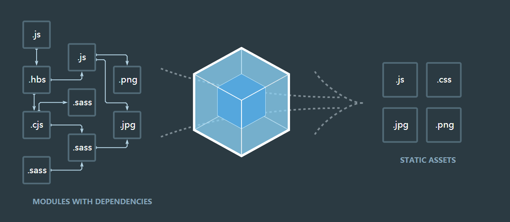

# 深入浅出 Webpack

> Smaller, Faster,  Modules

这是一篇读书笔记, 记录我在阅读**深入浅出 Webpack**和**Webpack 官方文档**过程中的所学所思🔥

# 模块化

> Module is the future!

对于现在的 Web 应用来说, 模块化是一个绕不开的话题. **模块化是指将一个复杂的系统分解为多个模块以方便编码, 简单来说就是: 输入/输出代码块**

在 jQuery 的那个时代, 大多数的脚本都是将其 API 挂载到全局命名空间（比如 `window.$`）下, 以在不同文件内进行引用.

现在回过头来思考一下, 这样的做法会带来一些问题

- 无法合理地管理项目的依赖和版本（命名空间冲突的问题）
- 无法方便地控制依赖的加载顺序

当项目的依赖增多或者前端项目变大时, 这种方式越来越难以维护, 于是有了模块的一些解决方案

这里仅针对 JavaScript 内的模块化方案进行介绍, 还有关于样式的模块化方案, 比如 `less` 等, 这里就不再进赘述, 目的是为了让你能够感知到: 

**我们封装了很多轮子, 来使我们更高效的编码, 但是往往需要编译后的代码才能来让机器执行**


## CommonJS

随着 NodeJS 的流行, 这种模块化方案被发扬光大, 其核心思想是**通过 `require` 方法来同步加载(输入)依赖, 通过 `module.exports` 来输出代码块**

CommonJS 通常被用来在非浏览器端管理依赖，设计目的是避免模块定义全局对象.

**在 CommonJS 内，一个文件就是一个模块**

可以直接在 NodeJS 环境下运行, 但是无法直接在浏览器环境下运行, 需要转换成标准 ES5 


## AMD

**AMD(Asynchronous Module Definition)** 顾名思义, 它采用异步的方式来加载依赖的模块, jQuery 时代里, [requirejs](https://requirejs.org/) 就是其典型代表.

看一个使用 `requirejs` 的例子：

```javascript
// defined a module
define('jquery', function(jq) {
  return jq.noConflict(true)
})

// require a moduel
require(['jquery'], function($) {
  console.log($)
})
```

其优势在于

- 可以直接在浏览器环境或者 NodeJS 环境下运行
- 可以异步加载依赖
- 可以并行加载多个依赖

缺点也很明显, 就是需要引入第三方依赖来实现


## ES6 module

这应该是大家非常熟悉的, 现代框架都是支持的模块化方案, 但是它也无法在 NodeJS 和浏览器环境下直接运行

- 一个文件就是一个模块，不支持按需加载
- ES6 模块是静态的，即导入后无法进行更改
- ES6 是指针绑定，在编译时输出，不同于 CommonJS 值绑定，模块内做出了修改，会反映到所有使用该模块的代码中
- ES6模块采用的是单例模式，每次对同一个模块的导入其实都指向同一个实例


## 构建

前端构建到底是怎么一回事呢？我们不妨从 [webpack](https://www.webpackjs.com/) 的官网上一窥究竟



**前端构建要做的就是将各个来源的资源（脚本文件也是资源）转换成可执行的 JavaScript, HTML, CSS 代码**

- 代码转换, 比如 TypeScript -> JavaScript, less/sass/scss -> css
- 文件优化, 即文件压缩
- 代码分割
- 模块合并, 将复用模块合并到同一个文件内
- 自动刷新, 监听文件变化, 重新构建并刷新浏览器页面
- 自动发布

# Webpack Config

这里我会对一些重要的配置属性进行介绍, 如有必要会针对性的进行深入分析

先来看一个简单的例子

```javascript
const path = require('path')

module.exports = {
  entry: './src/index.js',
  // to define the output file path and name
  // with NodeJS core module path
  output: {
    path: path.resolve(__dirname, 'dist'),
    filename: 'bundle.js'
  },
  // loaders to support file compiler
  // compiling form right to left 
  module: {
    rules: [
      {
        test: /\.css$/,
        // like get request to transfer params
        use: ['style-loader', 'css-loader']
      }
    ]
  }
}
```


我们先对 Webpack 的核心概念进行了解

- **Entry**: Webpack 执行构建任务的入口
- **Module**: 模块是 Webpack 内的核心概念, 一个文件对应一个模块, Webpack 会根据入口递归查找出所有模块的递归关系
- **Chunk**: 一个代码块由多个模块构成, 用于代码分割.
- **Loader**: 代码转换器, 查看[loaders](./loaders.md)
- **Plugin**: 扩展插件, 了解 [plugin](./plugin)
- **Output**: 输出内容


## Entry

`entry` 支持配置**多主入口**

> This is useful when you would like to inject multiple dependent files together and graph their dependencies into one chunk.

除了支持 string 外, 还可以通过列表或者对象的形式为其配置入口

- Entry 类型为 `string` 或者 `array`, 则只会生成一个 chunk, 且名字为 `main`
- Entry 类型为 `object`, 则会生成多个 chunk, 每个 chunk 名字为其**键值**

```javascript
module.exports = {
  // string -> main.js
  entry: './src/index.js',
	// array -> main.js
  entry: [
    './src/app1/index.js',
    './src/app2/index.js'
  ],
  // object -> app1.js, app2.js
  entry: {
    app1: './src/app1/index.js',
    app2: './src/app2/index.js'
  }
}
```


## Output

**output** 用来告诉 Webpack 如何在磁盘上写入最终输出的文件, 配置类型为 object

```javascript
output: {
  path: path.resolve(__dirname, 'dist'),
  // [name] will add filename
  filename: '[name].bundle.js',
  publicPath: 'https://7k7k.life/assets/'
},
```


- `path` 输出文件存放的目录, 是一个**绝对路径**, 通常通过 `path.resolve(__dirname, 'path')` 来定义
- `filename` 输出文件的名字, 支持模版字符串, 当 entry 配置为多入口时, 需要使用模版语法来确保每个输出文件有**唯一的名字**

| 变量名                                            | 含义                                 |
| :------------------------------------------------ | ------------------------------------ |
| id                                                | Chunk 的唯一标识，从0开始            |
| name                                              | Chunk 的名称                         |
| hash, 比如 `[hash:8]` 表示取8位 hash 值           | Chunk 的唯一标识的 Hash 值           |
| chunkhash                                         | Chunk 内容的 Hash 值, 由一组模块组成 |
| contenthash, 需要 `ExtractTextWebpackPlugin` 插件 | 代码内容本身组成的 Chunk             |

- `publicPath` 用来配置资源文件的路径, 比如你有一个图片服务器, 地址为 `https:www.images.com/assets/`, 此时可以配置 `output.publicPath:https:www.images.com/assets/ `, 它会告诉 Webpack, 在编译的时候碰到引用该地址的资源文件, 你不用进行感知, 并且这个属性支持在入口文件通过 `__webpack_public_path__ = PublicPath` 来进行动态配置


## Chunk

一个 **chunk** 由多个 module 组成, 用于代码分割和合并

**一个 entry 和其所有依赖的 Modules 组成一个 chunk**

举个例子: 在 webpack 4 之前, 通常将一些不会再改变的脚本(比如 `JQuery, Bootstrap` 等)放到一个 chunk 内(通常是 `vendor.js`), 这样做的目的是为了让浏览器缓存这些脚本, 从而减少加载时间

**webpack 4 之后通过 optimization.splitChunks 属性来配置, 进行代码分割**


## Loaders

Webpack 仅仅能够理解 `JavaScript` 和 `json` 类型文件, 这显然不足以覆盖我们的日常需求

Webpack 的 Loader 机制能够帮助我们打包 webpack 本身不支持的文件类型, 比如样式文件

- 将其转换为能够被应用“消费”的有意义的模块
- 将其加入到依赖视图

**loaders** 有两个配置属性

- `test` 用来匹配需要转换的文件类型
- `use` 用来分配对应的 loader 对该文件进行处理, loaders **从右至左进行解析**


## Plugins

Webpack 的 **Plugins** 机制能够帮助我们执行更“细致”的任务, 它可以看作是 **Loaders** 能力的扩展, 比如:

- 打包优化
- 资源管理
- 环境变量注入


