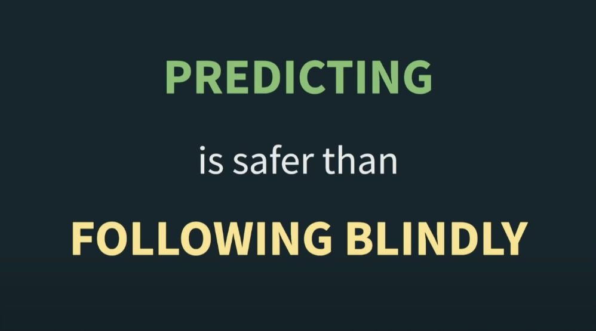
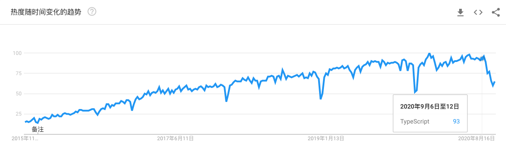
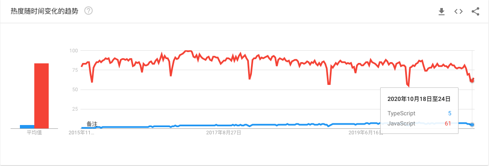
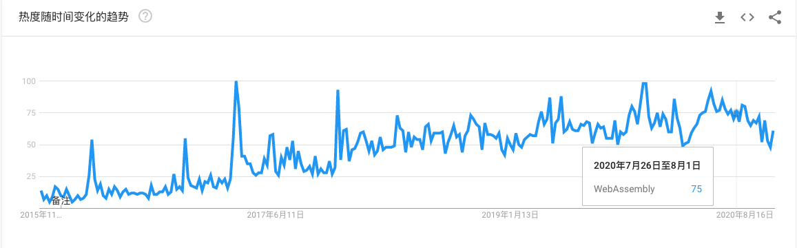
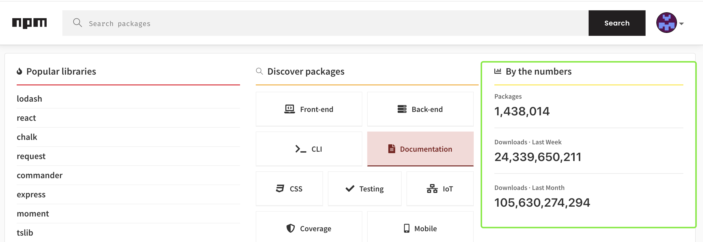

# YouTube

## Predicting the Future of the Web Development (2020 and 2025)

::: tip
Wonder what technologies and trends will dominate the web development in 2020 and 2025?

PREDICTING is safer than FOLLOWING BLINDLY
:::

Richard Feldman 发表了对于前端未来五年的一个小预测, 相信读到这里, 你聪明的脑袋一定有一个疑问, 何许人也?

这篇文章就从介绍他开始:

Richard 是一个“老前端”了, 编程 24 年, 经常发现一些程序或者设计的一些交互能够将浏览器跑到极限. 为此, 他不能再忍受了, 于是自己造了个“轮子” -- [**elm lang**](https://elm-lang.org/)(一个用来构建**可靠 Web 应用**的语言, 类比 JavaScript), 他是这个项目的核心开发者, 有兴趣可以去看看这个项目, 这里小羊就不深入展开了.

接下来我们来看看他关于前端在 2020 - 2025 的预测!

#### TypeScript

**TypeScrip**, 当然是 **TypeScript**

TypeScript 自 2012 年 10 月发布了0.8版本之后, 得到了广泛的关注, 并且随着之后版本对 IDE 更好的支持, TS成为了当之无愧的“前端炸子鸡”, 截止目前 **TypeScript 4.0** 已经发布了, 并且 TypeScript 4.1 也在预发阶段, 预计 11月3号 RC.

来看看 Richard 关于 TS 的预测:

**TypeScript takes over the JS world:**

​    \- TS is the most common choice for new commercial JS project(by end of 2020)

​    \- more people writing TS daily than JS without TS(by end of 2025)

他预测, TS 将会逐渐接管 JS, 到 2020 年 TypeScript 将会是商业 JS 项目最常见(第一优先级)的选择, 到 2025 年, TS 的日活将会超过 JS

事实上, 现在的前端开发者大部分都是 TypeScript 的拥护者和使用者, 在 JS 的工程化方面, 它能给我们提供了极大的便利, React-TS 的开发模式也是小羊现在的首选

为了验证他的说法, 我们看看 Google Trends 上的数据

**TS 最近五年的热度趋势**

**TS 对比 JS 的热度趋势**

个人认为, TypeScript 绝对是未来的趋势, 就像 NodeJs 的作者 Ryan 在开发 deno 时也是大多数模块支持 TS, 并且在发布会上赞其是“最棒的语言”(不用过分解读, 就是商业互吹), 但是, TS 能够完全取代 JS 呢, 只能说需要时间

所以, 如果你还没有系统的学习过 TS, 不妨现在就开始, 可以参考我之前的文章先入门~

#### Web Assembly

**Web Assembly** 通俗解释就是, 以前浏览器只能通过“点火器”来解析 .js 的文件, 现在, 谷歌设计了一种新的模式, 通过将其他语言转换为 .wasm 类型文件, 然后直接将其丢给浏览器去处理, 即建立了一座其他通用语言来控制浏览器行为的“彩虹桥”

它的优势在于, 可以在浏览器内运行“almost-machine-code”, 这意味着它有更好的性能表现

一起来看看 Richard 对于 Web Assembly 的预测:

  **WASM expands the Web App pie.**

​    \- wasm makes no signification difference to the makeup of the Web(by the end of 2020) 

​    \- wasm has created a new niche of heavyweight web apps

WASM 将会在 Web 应用市场内“分一杯羹”, 到 2020 年, 它对 Web 的构成没有作出任何有意义的改变, 但是到 2025 年, 会有一款成功的大型应用基于它进行实现

**看看 WASM 最近五年的热度趋势**

**“所以, 你还学得动吗?”**

如果你也感兴趣, 欢迎和小羊一起交流哦~

#### Packages

Packages 不用做过多介绍, 说是是前端的 **one piece** 应该不是很过分

目前比较流行的包管理工具(其实还是 npm 和 yarn 啦): 

\- [bower](https://bower.io/)

\- [entropic](https://www.entropic.dev/)

\- [npm](https://www.npmjs.com/)

\- [yarn](https://yarnpkg.com/)

\- github Pacakge Registry

其实目前的包管理模式也暴露出一些问题,比如当一些作者一怒之下删除了一个流传很广的第三方包, 可能会给很多开发者的工作带来麻烦, 或者在包内添加一些“恶意”代码, 会有安全问题(比如 2019 年, 圣诞节那天 ant-design 的“彩蛋”...)

推荐你使用 `npm config set ignore-scripts true` 来减小执行恶意代码的概率

言归正传, 看看他对于 package 的预测

**npm lasts, surviving further problems.**

​    - at least one new npm security incident makes headlines(by the end of 2020)

​    - at least one malicious npm package has infected many dev's machines(by the end of 2025)

`npm` 仍然会存在, 同时也伴随着更多的问题. 到 2020 年, 至少会有一个安全事件登上头条, 到 2025 年, 至少会有一个恶意软件包会影响诸多开发者

**看看下图内 npm 的使用程度**

朋友们,千万不要被"暗示"了, 我们还是做一些有益社区的事情

**素质开发, 从我做起**

小羊也发布了一些 package 在上面, 主要是 React 的组件,比如错误捕获, 单元格渲染和异步组件加载等, 如果你也有兴趣, 欢迎参与进来~

#### Compile-to-JS

最后一项,貌似是 Richard 这个小机灵鬼对自己的 elm 的一波推广, 主要预测了前端编译工具和语言

**JS alternatives stay niche, and age well.**

- Compile-to-JS languages still growing, but none as fast as TypeScript(by the end of 2020)
- Non-JS dialects have aged well, althougn TypeScript is more popular(by the end of 2025)

到目前为止, TypeScript 确实证明是一款的优秀的“编译为 JS”的语言, 所以赶快操练起来吧!

以上就是 RIchard 关于前端 2020-2025 的四个预测, 沉底发言一下, 就是重点学习和使用 **TypeScript**, 开始了解 **Web Assembly**, 同时可以关注一些 npm 包的“八卦”吧!

**Thanks for you reading, solo with code!**