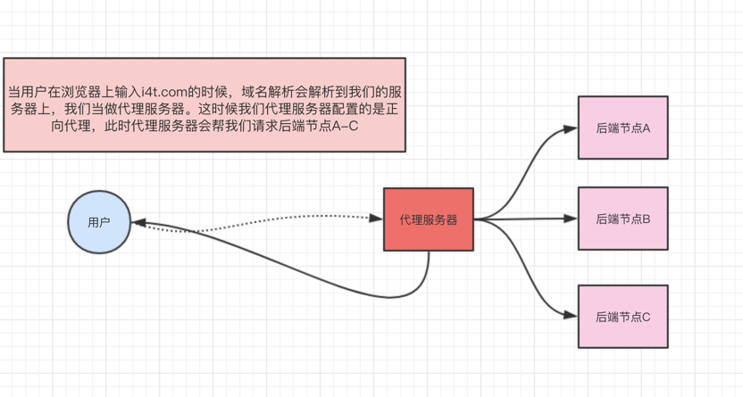
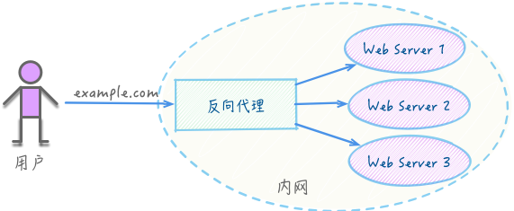

# Nginx

> Nginx是一款轻量级的HTTP服务器，采用事件驱动的异步非阻塞处理方式框架，这让其具有极好的IO性能，时常用于服务端的反向代理和负载均衡

## Install

在 Mac OS 上进行安装

- `brew update` 查看 brew 安装是否成功
- `brew search nginx` 查看 nginx 信息
- `brew install nginx` 安装 nginx
- `nginx -v` 查看 nginx 版本

安装成功之后

- `cd /usr/local/var/www` 查看主页内容
- `cd /usr/local/etc/nginx/nginx.conf` 修改配置文件（ubuntu 在 `/etc/nginx` 目录下）
- `nginx` 启动 nginx server
- `nginx -s stop` 终止 nginx server
- `nginx -s reload` 重启 nginx server


<b>解决 80 被 nginx welcome 页面默认占用的问题</b>

你希望把自己的主站绑定到 80 端口，但是发现 80 端口对应的页面已经被 nginx welcome 页面占用了，此时需要修改 `/etc/nginx/sites-enabled/default` 文件，将 80 端口换成其他端口，重启 nginx 即可


## Config

观察下面的配置:

- 开启 gzip
- 将 80 端口代理到 443, 支持 SSL 证书验证, 支持 https
- 访问 80 端口会被重定向到 443 端口
- 将静态文件代理到 443 端口
- 将本地服务占用端口代理到指定端口
- 将不同子域名的访问分发到不同的 location

参考

- [腾讯云 nginx 配置 SSL](https://cloud.tencent.com/document/product/400/35244)

```
#user  ylonely;
worker_processes  1;
events {
    worker_connections  1024;
}


http {
    include       mime.types;
    default_type  application/octet-stream;
    sendfile        on;
    keepalive_timeout  65;

    # gzip config
    gzip  on;
    # 压缩阈值 小于 10k 不压缩
    gzip_min_length 10k;
    # 分配 4*16k 的内存用于缓存压缩结果
    gzip_buffers 4 16k;
    # 压缩级别，越小越快，但是效果越差
    gzip_comp_level 3;
    # 压缩级别，越小越快，但是效果越差
    gzip_comp_level 3;
    # 设置支持压缩的Content-Type
    gzip_types text/plain application/x-javascript text/css application/xml text/javascript application/x-httpd-php image/jpeg image/gif image/png application/javascript;


    server {
        # SSL 访问端口为 443
        listen       443 ssl;
        # 绑定证书的域名
        server_name  www.7k7k.life;
        # 证书文件的名称
        ssl_certificate 1_www.7k7k.life_bundle.crt;
        # 私钥文件
        ssl_certificate_key 2_www.7k7k.life.key;
        ssl_session_timeout 5m;
        ssl_protocols TLSv1 TLSv1.1 TLSv1.2;
        # 套件加密
        ssl_ciphers ECDHE-RSA-AES128-GCM-SHA256:HIGH:!aNULL:!MD5:!RC4:!DHE;
        ssl_prefer_server_ciphers on;

        location / {
                root   /root/blog/dist/;
                index  index.html index.htm;
        }

    }

    server {
        listen 80;
        server_name www.7k7k.life;

        location /grow {
            proxy_pass http://localhost:3000/grow;
        }

        error_page   500 502 503 504  /50x.html;
        location = /50x.html {
            root   html;
         }
    }

    include servers/*;
}
```


### 理解 alias root location

nginx 指定文件路径有两种方式 root 和 alias

- alias 配置段仅为 location
- root 配置段为 http、server、location、if

两者的区别在于如何解释 location 的 uri 值，导致两者分别以不同的方式将请求映射到服务器文件上

- root的处理结果是：root＋location
- alias的处理结果是：使用 alias 替换 location，注意，使用 alias 时，目录名后面一定要加 /，否则会找不到文件


## Q && A

1. `Incompatible SockJS! Main site uses: "1.4.0", the iframe: "1.3.0".`

解决：添加如下配置

```
location / {
    proxy_pass our_server;
    proxy_redirect off;
    proxy_http_version 1.1;
    proxy_set_header Upgrade $http_upgrade;
    proxy_set_header Connection "upgrade";
}
```

2. `CreateDirectory()...failed (3: The system cannot find the path specified)` 

nginx 对于某个文件夹没有访问权限，无法创建 temp 文件夹

解决办法，添加如下代码，同时在nginx根目录手动创建temp及子文件夹

```
http {
		client_body_temp_path temp/client_body_temp;
		proxy_temp_path temp/proxy_temp;
    	fastcgi_temp_path temp/fastcgi_temp;
	}
```


## What's nginx?

nginx 可以简单理解成一个服务器

- 在处理高并发比apache更具优势
- 在底层服务端资源处理（静态资源处理转发、反向代理、负载均衡等）比node.js更具优势

### nginx 的研究方向

不同的 nginx 配置可以实现同样的功能，但是他们的效率会有较大差别，所以需要了解 nginx 的最优解

### 正向代理和反向代理

代理指的是代理服务器，介于客户端和服务器之间

- 正向表示代理的是客户端
- 反向表示代理的是服务器



正向代理

- 客户端和代理服务器之间可以相互访问，属于一个 LAN
- 代理对于用户是非透明的，即用户需要自己操作或者感知得到自己的请求被发送到代理服务器
- 代理服务器通过代理客户端的请求来向域外服务器请求响应内容




反向代理

- 代理服务器和内部服务器同可以相互访问，属于一个 LAN
- 代理服务器会向客户端提供一个统一的代理入口，客户端请求由代理服务控制
- nginx 充当的就是代理服务器的角色

反向代理的好处

- 安全和权限，可以在 nginx 层将危险和无权限的信息过滤掉，保证服务器的安全
- 负载均衡，nginx 可以将客户端请求合理分配到各个服务器上，同时可以通过轮询提供服务器安全检测服务，如果某个服务器异常，则不会为其分配请求，保证客户端访问的稳定性