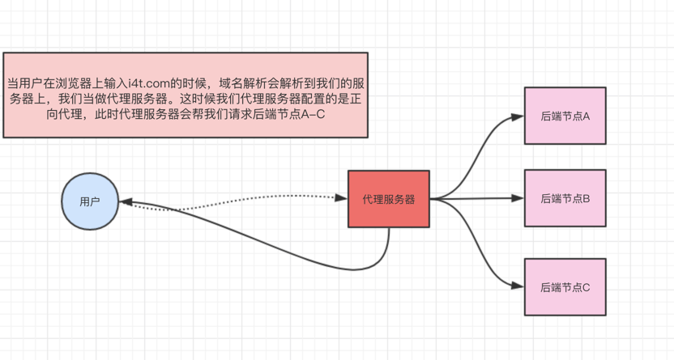
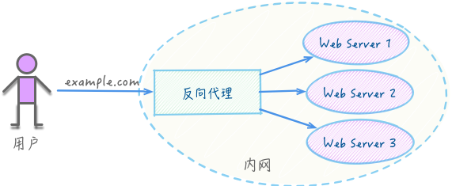

# Nginx

> Nginx是一款轻量级的HTTP服务器，采用事件驱动的异步非阻塞处理方式框架，这让其具有极好的IO性能，时常用于服务端的反向代理和负载均衡

## Install

在 Mac OS 上进行安装

- `brew update` 查看 brew 安装是否成功
- `brew search nginx` 查看 nginx 信息
- `brew install nginx` 安装 nginx
- `nginx -v` 查看 nginx 版本

安装成功之后

- `cd /usr/local/var/www` 查看主页内容
- `cd /usr/local/etc/nginx/nginx.conf` 修改配置文件
- `nginx` 启动 nginx server
- `nginx -s stop` 终止 nginx server
- `nginx -s reload` 重启 nginx server


## Config

假定一个场景：在一个项目内，后台在3000端口上持续运行，前端为静态文件，同时有一个文件夹用来存放上传的图片

- 后台服务启动之后，将其代理到 127.0.0.1:7777/service 路径下
- 将react工程内的 build/index.html 代理到 127.0.0.1:7777/ 路径下
- 将静态文件夹代理到 127.0.0.1:7777/pics 目录下

```
#user  ylonely;
worker_processes  1;

events {
    worker_connections  1024;
}

http {
    include       mime.types;
    default_type  application/octet-stream;
    sendfile        on;
    keepalive_timeout  65;
    server {
        listen       7777;
        server_name  127.0.0.1;

        location / {
	    	# 生产环境
            root   /Users/yango/Growup/YlonelY-GrowingUp/react-app/build/;
            index  index.html index.htm;
        }

		location /service {
		    proxy_pass http://localhost:3000/service;
		}

		location /pics {
            alias   /Users/yango/Growup/YlonelY-GrowingUp/koa-app/upload;
        }
    }

    include servers/*;
}
```

### 理解 alias root location

nginx 指定文件路径有两种方式 root 和 alias

- alias 配置段仅为 location
- root 配置段为 http、server、location、if

两者的区别在于如何解释 location 的 uri 值，导致两者分别以不同的方式将请求映射到服务器文件上

- root的处理结果是：root＋location
- alias的处理结果是：使用 alias 替换 location，注意，使用 alias 时，目录名后面一定要加 /，否则会找不到文件


## What's nginx?

nginx 可以简单理解成一个服务器

- 在处理高并发比apache更具优势
- 在底层服务端资源处理（静态资源处理转发、反向代理、负载均衡等）比node.js更具优势

### nginx 的研究方向

不同的 nginx 配置可以实现同样的功能，但是他们的效率会有较大差别，所以需要了解 nginx 的最优解

### 正向代理和反向代理

代理指的是代理服务器，介于客户端和服务器之间

- 正向表示代理的是客户端
- 反向表示代理的是服务器



正向代理

- 客户端和代理服务器之间可以相互访问，属于一个 LAN
- 代理对于用户是非透明的，即用户需要自己操作或者感知得到自己的请求被发送到代理服务器
- 代理服务器通过代理客户端的请求来向域外服务器请求响应内容




反向代理

- 代理服务器和内部服务器同可以相互访问，属于一个 LAN
- 代理服务器会向客户端提供一个统一的代理入口，客户端请求由代理服务控制
- nginx 充当的就是代理服务器的角色

反向代理的好处

- 安全和权限，可以在 nginx 层将危险和无权限的信息过滤掉，保证服务器的安全
- 负载均衡，nginx 可以将客户端请求合理分配到各个服务器上，同时可以通过轮询提供服务器安全检测服务，如果某个服务器异常，则不会为其分配请求，保证客户端访问的稳定性


### Q&A

1. `CreateDirectory()...failed (3: The system cannot find the path specified)` 

nginx 对于某个文件夹没有访问权限，无法创建 temp 文件夹

解决办法，添加如下代码，同时在nginx根目录手动创建temp及子文件夹

```
http {
		client_body_temp_path temp/client_body_temp;
		proxy_temp_path temp/proxy_temp;
    	fastcgi_temp_path temp/fastcgi_temp;
	}
```